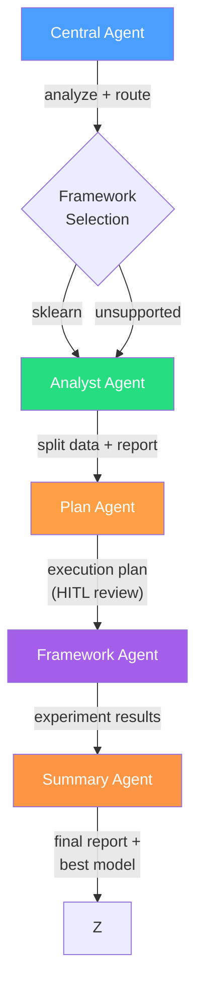

# Scientist-Bin

A multi-agent system that automatically trains and evaluates data science models. Describe your objective in plain language, upload a dataset, and the system handles everything from data profiling to model selection and deployment.

Built with [LangGraph](https://github.com/langchain-ai/langgraph) for agent orchestration and [Google Gemini](https://ai.google.dev/) as the LLM backbone.

## How It Works

### Standard Mode -- 5-Agent Pipeline

The default mode runs a linear pipeline that takes a natural-language objective and a dataset, then produces a trained model, evaluation metrics, and a comprehensive report.



| Agent | Role | Model Tier |
|-------|------|------------|
| **Central** | Analyze the request, classify the task, route to the right framework | Flash |
| **Analyst** | Profile the dataset, clean/preprocess, split into train/val/test | Pro |
| **Plan** | Search best practices online, create an execution plan, get human approval | Pro |
| **Sklearn** | Generate scikit-learn code, execute, iteratively refine, evaluate on test set | Pro |
| **Summary** | Review all runs, pick the best model, generate a final report with charts | Flash |

### Deep Research Mode -- Campaign Orchestrator

For complex problems, Deep Research mode wraps the standard pipeline in an iterative campaign loop that generates hypotheses, runs experiments, extracts insights, and learns from previous attempts:

```
generate_hypotheses -> run_experiment -> extract_insights -> check_budget -> loop
```

Findings are stored in a ChromaDB vector store so later iterations build on earlier discoveries. Use `--deep-research` on the CLI or `deep_research=True` in the API.

### Problem Types

| Type | Description | Example Datasets |
|------|-------------|------------------|
| **Classification** | Predict discrete labels | Iris, WineQT |
| **Regression** | Predict continuous values | AmesHousing |
| **Clustering** | Discover natural groupings | Mall_Customers, CC_GENERAL |

### Supported Frameworks

- **scikit-learn** -- fully supported (classification, regression, clustering)
- **FLAML** -- fully supported (AutoML for classification, regression, time series)
- **PyTorch** -- planned (GPU/CPU venv configs ready)
- **TensorFlow** -- planned (venv config ready)
- **Hugging Face Transformers / Diffusers** -- planned (venv configs ready)

Each framework runs in its own isolated virtual environment. See [Framework Provisioning](#framework-provisioning) below.

## Quick Start

### Prerequisites

- Python 3.11+, Node.js 22+
- [uv](https://docs.astral.sh/uv/) (Python), [pnpm](https://pnpm.io/) 10+ (Node)
- A [Google AI API key](https://aistudio.google.com/apikey)

### Install

```bash
git clone https://github.com/Scientist-Bin/Scientist-Bin.git
cd Scientist-Bin

# Configure
cp backend/.env.example backend/.env   # Set GOOGLE_API_KEY

# Backend (core + traditional ML frameworks in one venv — simplest for development)
cd backend && uv sync --all-groups --extra all-traditional

# Or: Backend (core only) + isolated framework venvs (production / no conflicts)
cd backend && uv sync --all-groups
cd backend && uv run scientist-bin provision analyst traditional

# Frontend
cd ../frontend && pnpm install
```

### Run -- Full Stack (Web UI)

```bash
# Terminal 1: backend
cd backend && uv run scientist-bin serve

# Terminal 2: frontend
cd frontend && pnpm dev
```

Open [http://localhost:5173](http://localhost:5173). The frontend proxies API calls to the backend at port 8000.

### Run -- CLI Only (No Server)

```bash
cd backend

# Standard pipeline
uv run scientist-bin train "Classify iris species" \
  --data-file data/iris_data/Iris.csv --auto-approve

# Deep research mode
uv run scientist-bin train "Predict house prices" \
  --data-file data/ames_data/AmesHousing.csv \
  --deep-research --budget 10 --time-limit 4h

# Standalone campaign
uv run scientist-bin campaign "Segment customers" \
  --data-file data/mall_data/Mall_Customers.csv --budget 5
```

## CLI Reference

All commands run from `backend/`.

### Local Commands

```bash
# Full pipeline
uv run scientist-bin train "Classify iris" --data-file data/iris_data/Iris.csv
uv run scientist-bin train "Classify iris" --auto-approve              # Skip plan review
uv run scientist-bin train "Classify iris" --deep-research --budget 10 # Deep research mode
uv run scientist-bin train "Classify iris" --quiet                     # JSON output only

# Standalone campaign
uv run scientist-bin campaign "objective" --data-file path --budget 10 --time-limit 4h

# Individual agents
uv run scientist-bin analyze data/iris_data/Iris.csv --objective "Classify iris"
uv run scientist-bin plan "Classify iris" --data-file data/iris_data/Iris.csv --run-analyst
uv run scientist-bin train-sklearn "Classify iris" --data-dir outputs/runs/<id>/data/ --problem-type classification
uv run scientist-bin summarize <experiment-id>

# Deployment
uv run scientist-bin deploy <experiment-id>                            # Build Docker image
uv run scientist-bin deploy <experiment-id> --tag mymodel:latest       # Custom tag
uv run scientist-bin deploy <experiment-id> --no-build --output-dir .  # Artifacts only

# Framework provisioning
uv run scientist-bin provision analyst traditional                     # Provision specific venvs
uv run scientist-bin provision --all                                   # Provision all venvs
uv run scientist-bin provision-status                                  # Check provisioning status
```

### Remote Commands (requires running server)

```bash
uv run scientist-bin train-remote "Classify iris" --auto-approve
uv run scientist-bin watch <experiment-id>
uv run scientist-bin review <experiment-id> "approve"
uv run scientist-bin download <experiment-id> model -o model.joblib
uv run scientist-bin list --status completed --framework sklearn
uv run scientist-bin show <experiment-id>
uv run scientist-bin delete <experiment-id>
```

## Output Artifacts

After training, artifacts are saved under `backend/outputs/`:

```
outputs/
├── models/<id>.joblib              # Best trained model
├── results/<id>.json               # Full result data
├── results/<id>_analysis.md        # Data analysis report
├── results/<id>_summary.md         # Summary report
├── results/<id>_plan.json          # Execution plan
├── results/<id>_charts.json        # Structured chart data
└── logs/<id>.jsonl                 # Decision journal
```

## Tech Stack

### Backend

- **Python 3.11+** with **FastAPI** and **LangGraph**
- **Google Gemini** via `langchain-google-genai` and `google-genai`
- **ChromaDB** for findings memory (Deep Research mode, optional)
- **Pydantic** for schemas, **Typer** for CLI
- **pandas**, **scikit-learn**, **FLAML**, **matplotlib** for data science execution (optional extras or isolated venvs)
- **uv** for packages, **ruff** for linting, **pytest** for testing (474+ tests)

### Frontend

- **React 19** with **TypeScript 5.9** (strict mode)
- **Vite 6**, **shadcn/ui** (Radix + Tailwind CSS v4)
- **React Router v7**, **TanStack React Query**, **Zustand**
- **Recharts** for visualizations (13 chart components)
- **pnpm** for packages, **Vitest** + **Testing Library** for testing (167+ tests)

## Framework Provisioning

ML framework dependencies are **not** installed by default. Two installation paths:

### Path A: Extras (simple, single venv)

```bash
cd backend
uv sync --all-groups --extra all-traditional   # analyst + sklearn + FLAML
uv sync --all-groups --extra pytorch-gpu       # PyTorch with CUDA
```

All deps go into the core `.venv`. Convenient for development. Some frameworks may conflict in the same venv (e.g., pytorch-gpu + tensorflow).

### Path B: Isolated venvs (production, no conflicts)

```bash
cd backend
uv run scientist-bin provision analyst traditional   # Provision specific venvs
uv run scientist-bin provision pytorch-gpu           # Provision PyTorch GPU
uv run scientist-bin provision --all                 # Provision everything
uv run scientist-bin provision-status                # Check status
```

Each framework gets its own `.venv` under `backend/framework_venvs/<name>/`. Full isolation. The `GET /api/v1/health` endpoint reports which frameworks are provisioned.

### Available Environments

| Venv | Frameworks | Key Deps |
|------|-----------|----------|
| `analyst` | Data profiler, cleaner, splitter | pandas, numpy, matplotlib, statsmodels |
| `traditional` | sklearn, FLAML | scikit-learn, flaml, pandas, joblib |
| `pytorch-gpu` | PyTorch (CUDA) | torch (cu128), torchvision |
| `pytorch-cpu` | PyTorch (CPU) | torch (cpu), torchvision |
| `tensorflow` | TensorFlow | tensorflow |
| `transformers` | HF Transformers | transformers, torch |
| `diffusers` | HF Diffusers | diffusers, torch, accelerate |

## Test Datasets

| Dataset | Path | Problem Type |
|---------|------|-------------|
| Iris | `data/iris_data/` | Classification |
| AmesHousing | `data/ames_data/` | Regression |
| WineQT | `data/wine_data/` | Classification / Regression |
| Mall_Customers | `data/mall_data/` | Clustering |
| CC_GENERAL | `data/cc_data/` | Clustering |

## Project Structure

```
Scientist-Bin/
├── backend/                         # Python backend (see backend/README.md)
│   ├── src/scientist_bin_backend/
│   │   ├── agents/
│   │   │   ├── base/                # Shared framework agent infrastructure
│   │   │   ├── central/             # Request analysis + routing
│   │   │   ├── analyst/             # Data profiling, cleaning, splitting
│   │   │   ├── plan/                # Online search, plan creation, HITL
│   │   │   ├── campaign/            # Deep Research campaign orchestrator
│   │   │   ├── hypothesis/          # Hypothesis generation for campaigns (planned)
│   │   │   ├── frameworks/
│   │   │   │   ├── sklearn/         # Scikit-learn code gen + execution
│   │   │   │   └── flaml/           # FLAML AutoML code gen + execution
│   │   │   └── summary/             # Best model selection + report
│   │   ├── api/                     # FastAPI routes + experiment store
│   │   ├── deploy/                  # Docker deployment (templates, builder)
│   │   ├── memory/                  # Findings store (ChromaDB), ERL journal
│   │   ├── execution/               # Sandboxed code runner, budgets, journal
│   │   └── utils/                   # LLM helpers, artifacts, naming
│   ├── framework_venvs/             # Isolated ML execution venvs (one per framework)
│   ├── tests/                       # 474+ tests (pytest)
│   └── data/                        # Input datasets
├── frontend/                        # React frontend (see frontend/README.md)
│   └── src/
│       ├── features/                # Feature modules (1 per page)
│       ├── components/              # Shared UI, charts, layout
│       ├── hooks/                   # Shared hooks
│       ├── lib/                     # API client, metric utilities
│       ├── stores/                  # Zustand state
│       └── types/                   # TypeScript interfaces
└── .github/workflows/ci.yml        # CI: lint + test + build
```

## Development

```bash
# Backend (from backend/)
uv run pytest -v                     # Run all 474+ tests
uv run pytest -m slow                # E2E pipeline tests (requires GOOGLE_API_KEY)
uv run ruff check . && uv run ruff format .

# Frontend (from frontend/)
pnpm test                            # Run all 167+ tests
pnpm lint && pnpm format
pnpm build                           # Type-check + production build
```

## CI

GitHub Actions runs on push/PR to `main` and `develop`:

- **Backend:** ruff lint + pytest
- **Frontend:** ESLint + TypeScript check + Vitest + production build

## More Information

- [Backend README](backend/README.md) -- architecture details, API reference, agent internals
- [Frontend README](frontend/README.md) -- page details, component architecture, hooks
