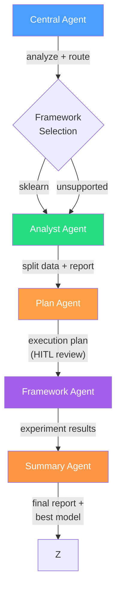

# Scientist-Bin Backend

Multi-agent system for automated data science model training and evaluation. Built with Python, LangGraph, FastAPI, and Google Gemini.

## Quick Start

**Prerequisites:** Python 3.11+, [uv](https://docs.astral.sh/uv/)

```bash
# Windows
start.bat

# Linux / macOS
./start.sh
```

Or manually:

```bash
cp .env.example .env          # Edit .env and set GOOGLE_API_KEY
uv sync --all-groups          # Install all dependencies
uv run uvicorn scientist_bin_backend.main:app --reload  # Start dev server
```

The API runs at `http://localhost:8000`. Docs at `/docs`, health check at `/api/v1/health`.

## Architecture

The system uses a 5-agent pipeline orchestrated by the central agent:



### Pipeline Detail

```
Central Agent (orchestrator)
  |
  +-- analyze (structured TaskAnalysis)
  +-- route (deterministic-first framework selection)
  |
  Analyst Agent
  |  profile_data -> clean_data -> split_data -> write_report
  |
  Plan Agent (HITL) — receives real data characteristics from analyst
  |  research -> write_plan -> review_plan (human approval loop) -> save_plan
  |
  Framework Agent (e.g. Sklearn, iterative)
  |  generate_code -> execute_code -> analyze_results
  |     -> (refine / new algo / feature eng) -> generate_code  (loop)
  |     -> fix_error -> error_research -> generate_code       (error path)
  |     -> (accept / abort) -> finalize -> END
  |
  Summary Agent
     review_experiments -> select_best -> generate_report
```

### Error Retry Separation

The framework agent separates optimization iterations from error retries:

- `current_iteration` only increments on **successful** execution (optimization budget)
- `error_retry_count` tracks consecutive failed execution attempts (resets to 0 on success)
- `max_error_retries` defaults to 3 -- error fix attempts don't consume the optimization budget

When code execution fails, the agent attempts to fix the error up to `max_error_retries` times. If retries are exhausted, it moves to a new algorithm or aborts. Successful execution resets the error counter and advances the iteration.

### Per-Agent Model Assignment

| Agent | Model | Purpose |
|-------|-------|---------|
| Central | `gemini-3-flash-preview` | Fast routing and analysis |
| Analyst | `gemini-3.1-pro-preview` | Data profiling, cleaning, splitting |
| Plan | `gemini-3.1-pro-preview` | Detailed research and planning |
| Sklearn | `gemini-3.1-pro-preview` | Code generation and error research |
| Summary | `gemini-3-flash-preview` | Experiment review and report generation |

## Deep Research Mode

Deep Research mode wraps the standard 5-agent pipeline in a **campaign orchestrator** that runs iterative experiments with hypothesis generation and findings memory.

### Campaign Loop

```
generate_hypotheses -> run_next_experiment -> extract_insights -> check_budget
                                                                      |
                                                            continue -> generate_hypotheses (loop)
                                                            stop -> END
```

1. **generate_hypotheses** -- the hypothesis agent proposes experiments based on the objective, data, and accumulated findings
2. **run_next_experiment** -- runs the full 5-agent pipeline for the top hypothesis
3. **extract_insights** -- analyzes results and stores findings in the vector store
4. **check_budget** -- stops if the iteration or time budget is exhausted, otherwise loops

### Findings Memory

Campaign insights are stored in a **ChromaDB vector store** (`memory/findings_store.py`) so later iterations can retrieve relevant prior results. ChromaDB is an optional dependency — when not installed, the findings store degrades gracefully to a no-op. The **ERL journal** (`memory/erl_journal.py`) tracks decisions, reflections, and heuristics across the campaign.

### Activation

- **CLI:** `uv run scientist-bin train "objective" --data-file path --deep-research --budget 10 --time-limit 4h`
- **CLI (standalone):** `uv run scientist-bin campaign "objective" --data-file path --budget 10 --time-limit 4h`
- **API:** Set `deep_research=True` in the `POST /api/v1/train` body, with optional `budget_max_iterations` and `budget_time_limit_seconds`

## Project Structure

```
backend/
├── start.bat / start.sh           # Startup scripts
├── pyproject.toml                 # Dependencies, build config
├── .env.example                   # Environment template
├── data/                          # Input datasets
│   └── iris_data/Iris.csv         # Example dataset (150 rows, 3 classes)
├── outputs/                       # Agent-generated output (git-ignored)
│   ├── models/                    # Best model per experiment (<id>.joblib)
│   ├── results/                   # Result JSON, analysis report, summary report, plan
│   ├── logs/                      # Decision journal per experiment (<id>.jsonl)
│   ├── experiments/               # Experiment store (JSON persistence)
│   └── runs/                      # Raw per-run execution artifacts
│       └── <id>/
│           ├── data/              # Cleaned CSV, split CSVs, analysis report
│           └── summary/           # Summary report markdown + chart data JSON
├── src/scientist_bin_backend/     # Main package
│   ├── agents/
│   │   ├── base/                  # Shared nodes (code_executor, results_analyzer) and schemas
│   │   ├── central/               # Orchestrator (analyze -> route -> delegate pipeline)
│   │   ├── plan/                  # Plan agent (research, execution plan, HITL review)
│   │   ├── analyst/               # Analyst agent (profile, clean, split, report)
│   │   ├── campaign/              # Campaign orchestrator (Deep Research iterative loop)
│   │   ├── hypothesis/            # Hypothesis generation for campaign mode (planned, not yet implemented)
│   │   ├── frameworks/
│   │   │   └── sklearn/           # Sklearn agent (generate -> execute -> analyze loop)
│   │   │       └── skills/        # 5 skills: classification, regression, clustering, evaluation, preprocessing
│   │   └── summary/               # Summary agent (review, select, report)
│   ├── execution/                 # Sandboxed code runner, budget, journal, estimator
│   ├── events/                    # SSE event bus for real-time streaming
│   ├── api/                       # FastAPI routes + experiment store
│   ├── config/                    # Pydantic settings
│   ├── deploy/                    # Docker deployment (templates, builder)
│   ├── memory/                    # Findings store (ChromaDB vector), ERL journal
│   └── utils/                     # LLM helpers, SKILL.md loader, artifact saver
└── tests/                         # pytest test suite
```

## API Endpoints

| Method | Path | Description |
|--------|------|-------------|
| `POST` | `/api/v1/train` | Submit training request (validates data file, runs pipeline in background). Accepts `deep_research`, `budget_max_iterations`, `budget_time_limit_seconds` |
| `GET` | `/api/v1/experiments` | List experiments with filtering (`status`, `framework`, `problem_type`, `search`) and pagination (`offset`, `limit`) |
| `GET` | `/api/v1/experiments/{id}` | Get experiment details |
| `GET` | `/api/v1/experiments/{id}/events` | SSE stream of real-time events |
| `POST` | `/api/v1/experiments/{id}/review` | Submit plan review feedback (HITL) |
| `GET` | `/api/v1/experiments/{id}/journal` | Agent decision journal |
| `GET` | `/api/v1/experiments/{id}/plan` | Get the execution plan |
| `GET` | `/api/v1/experiments/{id}/analysis` | Get the analyst report and split data paths |
| `GET` | `/api/v1/experiments/{id}/summary` | Get the summary report |
| `GET` | `/api/v1/experiments/{id}/artifacts/{type}` | Download artifact (model, results, analysis, summary, plan, charts, journal) |
| `DELETE` | `/api/v1/experiments/{id}` | Delete experiment |
| `POST` | `/api/v1/experiments/{id}/deploy` | Deploy model (mock) |
| `POST` | `/api/v1/experiments/{id}/undeploy` | Undeploy model (mock) |
| `GET` | `/api/v1/experiments/{id}/deployment` | Get deployment status |
| `POST` | `/api/v1/predict/{id}` | Mock prediction endpoint |
| `GET` | `/api/v1/health` | Health check |

Data file paths in train requests are resolved relative to `backend/data/` by default (e.g., `iris_data/Iris.csv`). Invalid paths are rejected with HTTP 400 before the agent starts.

The `auto_approve_plan` field in the train request body skips human-in-the-loop plan review. When `false`, the pipeline pauses at the plan review step; submit feedback via `POST /api/v1/experiments/{id}/review`.

## CLI

```bash
# Local execution
uv run scientist-bin serve                                                          # Start server
uv run scientist-bin train "Classify iris" --data-file data/iris_data/Iris.csv      # Train locally
uv run scientist-bin train "Classify iris" --data-file data/iris_data/Iris.csv -q   # JSON only
uv run scientist-bin train "Classify iris" --auto-approve                           # Skip plan review
uv run scientist-bin train "Predict prices" --data-file data/ames_data/AmesHousing.csv --deep-research --budget 10 --time-limit 4h  # Deep Research mode

# Standalone campaign
uv run scientist-bin campaign "Segment customers" --data-file data/mall_data/Mall_Customers.csv --budget 5 --time-limit 2h

# Standalone agent commands
uv run scientist-bin analyze data/iris_data/Iris.csv --objective "Classify iris"    # Analyst only
uv run scientist-bin plan "Classify iris" --data-file data/iris_data/Iris.csv --run-analyst --auto-approve  # Plan with auto-analyst
uv run scientist-bin train-sklearn "Classify iris" --data-dir outputs/runs/<id>/data/ --problem-type classification  # Sklearn only
uv run scientist-bin summarize <experiment-id>                                      # Summary only

# Deployment
uv run scientist-bin deploy <experiment-id>                                         # Generate Dockerfile + build image
uv run scientist-bin deploy <experiment-id> --tag mymodel:latest                    # Custom image tag
uv run scientist-bin deploy <experiment-id> --push                                  # Build + push to registry
uv run scientist-bin deploy <experiment-id> --no-build --output-dir ./deploy        # Artifacts only (no Docker build)

# Remote server commands
uv run scientist-bin train-remote "Classify iris" --auto-approve                    # Submit + stream events
uv run scientist-bin watch <experiment-id>                                          # Stream events from running experiment
uv run scientist-bin review <experiment-id> "approve"                               # Submit plan review
uv run scientist-bin download <experiment-id> model -o model.joblib                 # Download artifact
uv run scientist-bin download <experiment-id> all                                   # Download all artifacts
uv run scientist-bin list --status completed --framework sklearn --search "iris"    # Filtered list
uv run scientist-bin show <id> --json                                               # Show experiment
uv run scientist-bin delete <id>                                                    # Delete experiment
```

The `train` command prints real-time progress as all five agents run:

```
  Scientist-Bin  |  Training Agent
  Experiment: 42ab3ddd43e8
  Objective:  Classify iris species
  Data file:  C:\...\data\iris_data\Iris.csv

  [analyst] Profiling data...
  [analyst] Classified as classification
  [analyst] Cleaning data (150 -> 150 rows)
  [analyst] Data split (stratified): train=105, val=22, test=23
  [analyst] Analysis report generated
  [plan] Researching best practices...
  [plan] Execution plan generated (classification, 3 algorithms)
  [plan] Plan auto-approved
  [sklearn] generate_code (iter 0)
  [sklearn] run started (timeout: 60s)
  [sklearn] run completed in 3.6s
  [sklearn] analyze_results -> accept
  [summary] Reviewing 1 experiments
  [summary] Best model: LogisticRegression (accuracy=1.0000)
  [done] Summary report generated

  [saved] Results  -> ...\outputs\results\42ab3ddd43e8.json
  [saved] Model    -> ...\outputs\models\42ab3ddd43e8.joblib
  [saved] Journal  -> ...\outputs\logs\42ab3ddd43e8.jsonl
  [saved] Analysis -> ...\outputs\results\42ab3ddd43e8_analysis.md
  [saved] Summary  -> ...\outputs\results\42ab3ddd43e8_summary.md
```

Use `--quiet` / `-q` to suppress progress output and emit only the final JSON result. Use `--auto-approve` to skip the human-in-the-loop plan review step. Data file paths (`--data-file`) are resolved to absolute and validated before the agent starts. The `.env` file is always loaded from `backend/` regardless of the current working directory.

## Docker Deployment

Deploy a trained model as a Docker inference container:

```bash
uv run scientist-bin deploy <experiment-id>
```

This generates:
- **Dockerfile** -- Python base image with scikit-learn and FastAPI
- **serve.py** -- FastAPI inference server with `/predict`, `/health`, and `/info` endpoints
- **requirements.txt** -- pinned dependencies

Options:

| Flag | Description |
|------|-------------|
| `--tag name:tag` | Custom Docker image tag (default: `scientist-bin-<id>:latest`) |
| `--push` | Push image to registry after build |
| `--no-build` | Generate artifacts only, skip Docker build |
| `--output-dir path` | Write artifacts to a custom directory |

The generated artifacts are in `deploy/` under the experiment's run directory. Templates are defined in `deploy/templates.py` and the build logic is in `deploy/builder.py`.

## Skills

The Sklearn agent uses 5 modular skills with `SKILL.md` reference files that are injected into code generation prompts:

| Skill | Description |
|-------|-------------|
| `classification` | Classifiers, metrics (accuracy, F1, ROC-AUC), stratified splitting |
| `regression` | Regressors, metrics (RMSE, MAE, R2), residual analysis |
| `clustering` | Clustering algorithms, metrics (silhouette, Davies-Bouldin), cluster profiling |
| `evaluation` | Cross-validation, hyperparameter tuning, model comparison |
| `preprocessing` | Encoding, scaling, imputation, feature engineering |

Skills are discovered at runtime via `utils/skill_loader.py` and follow the [Anthropic Agent Skills spec](https://agentskills.io/specification).

## Key Design Decisions

- **5-agent pipeline**: Separates concerns (planning, data analysis, training, summarizing) across specialized agents with appropriate model assignments.
- **Human-in-the-loop planning**: The plan agent uses LangGraph `interrupt()` for human review. Auto-approve mode is available for automated workflows.
- **Real code execution**: Generated code runs in sandboxed subprocesses (not `exec()`). Process isolation, timeout enforcement, stdout/stderr capture.
- **Per-agent model selection**: Each agent uses the right model for its task -- fast flash models for routing/summarizing, capable pro models for planning/coding.
- **SKILL.md integration**: Skills follow the [Anthropic Agent Skills spec](https://agentskills.io/specification). The planner loads the matching skill and injects its body into the prompt.
- **Experiment journal**: Append-only JSONL log per experiment captures decisions, reflections, and heuristics (ERL pattern).
- **Duration estimation**: Predicts training time from dataset size and adjusts subprocess timeout dynamically.

## Development

```bash
uv run pytest -v                          # Run all 490+ tests (E2E skipped without API key)
uv run pytest -m slow                     # E2E pipeline tests (requires GOOGLE_API_KEY)
uv run pytest tests/test_e2e_flaml.py -m slow  # FLAML-specific E2E tests
uv run pytest tests/execution/test_flaml_codegen.py  # FLAML code execution (no LLM)
uv run pytest tests/test_contracts.py     # Backend-frontend contract tests
uv run pytest -k "iris"                   # Integration tests with real data
uv run ruff check .                       # Lint
uv run ruff format .                      # Format
```

## Environment Variables

| Variable | Default | Description |
|----------|---------|-------------|
| `GOOGLE_API_KEY` | (required) | Google Gemini API key |
| `SCIENTIST_BIN_GEMINI_MODEL` | `gemini-2.0-flash` | Default Gemini model (fallback) |
| `SCIENTIST_BIN_GEMINI_MODEL_FLASH` | `gemini-3-flash-preview` | Fast model for routing/summary |
| `SCIENTIST_BIN_GEMINI_MODEL_PRO` | `gemini-3.1-pro-preview` | Capable model for planning/coding |
| `SCIENTIST_BIN_DEBUG` | `false` | Debug mode |
| `SCIENTIST_BIN_CORS_ORIGINS` | `["http://localhost:5173"]` | CORS origins |
| `SCIENTIST_BIN_SANDBOX_TIMEOUT` | `300` | Seconds per code execution |
| `SCIENTIST_BIN_MAX_ITERATIONS` | `5` | Max iteration cycles |
| `SCIENTIST_BIN_SANDBOX_MAX_OUTPUT_BYTES` | `1000000` | Stdout cap per execution (1 MB) |

## Adding a New Framework Subagent

1. Create `agents/myframework/` with `graph.py`, `agent.py`, `states.py`, `schemas.py`, `nodes/`, `prompts.py`
2. Implement code generation and execution nodes (the plan and analyst agents provide the execution plan and split data)
3. Add SKILL.md files under `skills/` per problem type if desired
4. Add one entry to `FRAMEWORK_REGISTRY` in `agents/central/nodes/router.py` mapping the framework name to the fully-qualified agent class path
