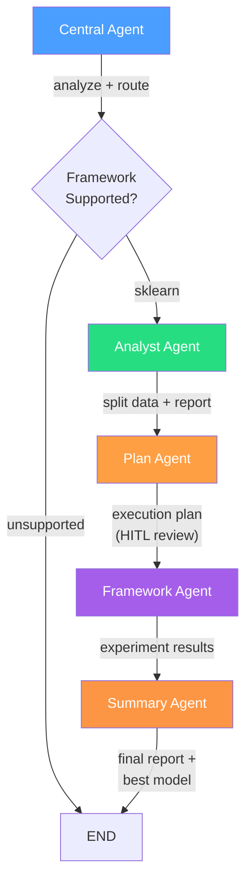

# Scientist-Bin Backend

Multi-agent system for automated data science model training and evaluation. Built with Python, LangGraph, FastAPI, and Google Gemini.

## Quick Start

**Prerequisites:** Python 3.11+, [uv](https://docs.astral.sh/uv/)

```bash
# Windows
start.bat

# Linux / macOS
./start.sh
```

Or manually:

```bash
cp .env.example .env          # Edit .env and set GOOGLE_API_KEY
uv sync --all-groups          # Install all dependencies
uv run uvicorn scientist_bin_backend.main:app --reload  # Start dev server
```

The API runs at `http://localhost:8000`. Docs at `/docs`, health check at `/api/v1/health`.

## Architecture

The system uses a 5-agent pipeline orchestrated by the central agent:



### Pipeline Detail

```
Central Agent (orchestrator)
  |
  +-- analyze (structured TaskAnalysis)
  +-- route (deterministic-first framework selection)
  |
  Analyst Agent
  |  profile_data -> clean_data -> split_data -> write_report
  |
  Plan Agent (HITL) — receives real data characteristics from analyst
  |  rewrite_query -> research -> write_plan -> review_plan (human approval loop)
  |
  Framework Agent (e.g. Sklearn, iterative)
  |  generate_code -> execute_code -> analyze_results
  |     -> (refine / new algo / feature eng) -> generate_code  (loop)
  |     -> fix_error -> error_research -> generate_code       (error path)
  |     -> (accept / abort) -> finalize -> END
  |
  Summary Agent
     review_experiments -> select_best -> generate_report
```

### Per-Agent Model Assignment

| Agent | Model | Purpose |
|-------|-------|---------|
| Central | `gemini-3-flash-preview` | Fast routing and analysis |
| Analyst | `gemini-3.1-pro-preview` | Data profiling, cleaning, splitting |
| Plan | `gemini-3.1-pro-preview` | Detailed research and planning |
| Sklearn | `gemini-3.1-pro-preview` | Code generation and error research |
| Summary | `gemini-3-flash-preview` | Experiment review and report generation |

## Project Structure

```
backend/
├── start.bat / start.sh           # Startup scripts
├── pyproject.toml                 # Dependencies, build config
├── .env.example                   # Environment template
├── data/                          # Input datasets
│   └── iris_data/Iris.csv         # Example dataset (150 rows, 3 classes)
├── outputs/                       # Agent-generated output (git-ignored)
│   ├── models/                    # Best model per experiment (<id>.joblib)
│   ├── results/                   # Result JSON, analysis report, summary report, plan
│   ├── logs/                      # Decision journal per experiment (<id>.jsonl)
│   ├── experiments/               # Experiment store (JSON persistence)
│   └── runs/                      # Raw per-run execution artifacts
│       └── <id>/
│           ├── data/              # Cleaned CSV, split CSVs, analysis report
│           └── summary/           # Summary report markdown
├── src/scientist_bin_backend/     # Main package
│   ├── agents/
│   │   ├── base/                  # Shared nodes (code_executor, results_analyzer) and schemas
│   │   ├── central/               # Orchestrator (analyze -> route -> delegate pipeline)
│   │   ├── plan/                  # Plan agent (query rewrite, research, HITL review)
│   │   ├── analyst/               # Analyst agent (profile, clean, split, report)
│   │   ├── sklearn/               # Sklearn agent (generate -> execute -> analyze loop)
│   │   └── summary/               # Summary agent (review, select, report)
│   ├── execution/                 # Sandboxed code runner, budget, journal, estimator
│   ├── events/                    # SSE event bus for real-time streaming
│   ├── api/                       # FastAPI routes + experiment store
│   ├── config/                    # Pydantic settings
│   └── utils/                     # LLM helpers, SKILL.md loader, artifact saver
└── tests/                         # pytest test suite
```

## API Endpoints

| Method | Path | Description |
|--------|------|-------------|
| `POST` | `/api/v1/train` | Submit training request (validates data file, runs 5-agent pipeline in background) |
| `GET` | `/api/v1/experiments` | List all experiments |
| `GET` | `/api/v1/experiments/{id}` | Get experiment details |
| `GET` | `/api/v1/experiments/{id}/events` | SSE stream of real-time events |
| `GET` | `/api/v1/experiments/{id}/journal` | Agent decision journal |
| `GET` | `/api/v1/experiments/{id}/plan` | Get the execution plan |
| `GET` | `/api/v1/experiments/{id}/analysis` | Get the analyst report and split data paths |
| `GET` | `/api/v1/experiments/{id}/summary` | Get the summary report |
| `GET` | `/api/v1/experiments/{id}/artifacts/model` | Download trained model (.joblib) |
| `GET` | `/api/v1/experiments/{id}/artifacts/results` | Download results JSON |
| `DELETE` | `/api/v1/experiments/{id}` | Delete experiment |
| `GET` | `/api/v1/health` | Health check |

Data file paths in train requests are resolved relative to `backend/data/` by default (e.g., `iris_data/Iris.csv`). Invalid paths are rejected with HTTP 400 before the agent starts.

The `auto_approve_plan` field in the train request body skips human-in-the-loop plan review.

## CLI

```bash
uv run scientist-bin serve                                                          # Start server
uv run scientist-bin train "Classify iris" --data-file data/iris_data/Iris.csv      # Train locally
uv run scientist-bin train "Classify iris" --data-file data/iris_data/Iris.csv -q   # JSON only
uv run scientist-bin train "Classify iris" --auto-approve                           # Skip plan review
uv run scientist-bin train-remote "Classify iris"                                   # Submit to server
uv run scientist-bin list                                                           # List experiments
uv run scientist-bin show <id> --json                                               # Show experiment
uv run scientist-bin delete <id>                                                    # Delete experiment
```

The `train` command prints real-time progress as all five agents run:

```
  Scientist-Bin  |  Training Agent
  Experiment: 42ab3ddd43e8
  Objective:  Classify iris species
  Data file:  C:\...\data\iris_data\Iris.csv

  [analyst] Profiling data...
  [analyst] Classified as classification
  [analyst] Cleaning data (150 -> 150 rows)
  [analyst] Data split (stratified): train=105, val=22, test=23
  [analyst] Analysis report generated
  [plan] Rewriting query...
  [plan] Researching best practices...
  [plan] Execution plan generated (classification, 3 algorithms)
  [plan] Plan auto-approved
  [sklearn] generate_code (iter 0)
  [sklearn] run started (timeout: 60s)
  [sklearn] run completed in 3.6s
  [sklearn] analyze_results -> accept
  [summary] Reviewing 1 experiments
  [summary] Best model: LogisticRegression (accuracy=1.0000)
  [done] Summary report generated

  [saved] Results  -> ...\outputs\results\42ab3ddd43e8.json
  [saved] Model    -> ...\outputs\models\42ab3ddd43e8.joblib
  [saved] Journal  -> ...\outputs\logs\42ab3ddd43e8.jsonl
  [saved] Analysis -> ...\outputs\results\42ab3ddd43e8_analysis.md
  [saved] Summary  -> ...\outputs\results\42ab3ddd43e8_summary.md
```

Use `--quiet` / `-q` to suppress progress output and emit only the final JSON result. Use `--auto-approve` to skip the human-in-the-loop plan review step. Data file paths (`--data-file`) are resolved to absolute and validated before the agent starts. The `.env` file is always loaded from `backend/` regardless of the current working directory.

## Key Design Decisions

- **5-agent pipeline**: Separates concerns (planning, data analysis, training, summarizing) across specialized agents with appropriate model assignments.
- **Human-in-the-loop planning**: The plan agent uses LangGraph `interrupt()` for human review. Auto-approve mode is available for automated workflows.
- **Real code execution**: Generated code runs in sandboxed subprocesses (not `exec()`). Process isolation, timeout enforcement, stdout/stderr capture.
- **Per-agent model selection**: Each agent uses the right model for its task -- fast flash models for routing/summarizing, capable pro models for planning/coding.
- **SKILL.md integration**: Skills follow the [Anthropic Agent Skills spec](https://agentskills.io/specification). The planner loads the matching skill and injects its body into the prompt.
- **Experiment journal**: Append-only JSONL log per experiment captures decisions, reflections, and heuristics (ERL pattern).
- **Duration estimation**: Predicts training time from dataset size and adjusts subprocess timeout dynamically.

## Development

```bash
uv run pytest -v              # Run all tests
uv run pytest -k "iris"       # Integration tests with real data
uv run ruff check .           # Lint
uv run ruff format .          # Format
```

## Environment Variables

| Variable | Default | Description |
|----------|---------|-------------|
| `GOOGLE_API_KEY` | (required) | Google Gemini API key |
| `SCIENTIST_BIN_GEMINI_MODEL` | `gemini-2.0-flash` | Default Gemini model (fallback) |
| `SCIENTIST_BIN_GEMINI_MODEL_FLASH` | `gemini-3-flash-preview` | Fast model for routing/summary |
| `SCIENTIST_BIN_GEMINI_MODEL_PRO` | `gemini-3.1-pro-preview` | Capable model for planning/coding |
| `SCIENTIST_BIN_DEBUG` | `false` | Debug mode |
| `SCIENTIST_BIN_CORS_ORIGINS` | `["http://localhost:5173"]` | CORS origins |
| `SCIENTIST_BIN_SANDBOX_TIMEOUT` | `300` | Seconds per code execution |
| `SCIENTIST_BIN_MAX_ITERATIONS` | `5` | Max iteration cycles |
| `SCIENTIST_BIN_SANDBOX_MAX_OUTPUT_BYTES` | `1000000` | Stdout cap per execution (1 MB) |

## Adding a New Framework Subagent

1. Create `agents/myframework/` with `graph.py`, `agent.py`, `states.py`, `schemas.py`, `nodes/`, `prompts.py`
2. Implement code generation and execution nodes (the plan and analyst agents provide the execution plan and split data)
3. Add SKILL.md files under `skills/` per problem type if desired
4. Add one entry to `FRAMEWORK_REGISTRY` in `agents/central/nodes/router.py` mapping the framework name to the fully-qualified agent class path
