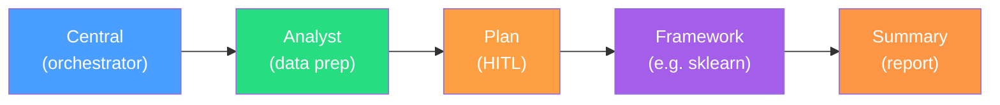

# Agents

Multi-agent system with a central orchestrator, data analyst agent, planning agent, framework-specific subagents, and a summary agent.

## Architecture



```
agents/
├── base/       — Shared nodes (code_executor, results_analyzer) and schemas
├── central/    — Orchestrator: analyze -> route -> delegate to 4-agent pipeline
├── analyst/    — Data profiling, cleaning, train/val/test splitting, analysis report
├── plan/       — Web research, execution plan generation, HITL review, plan saving
├── sklearn/    — Iterative code generation, execution, and refinement loop
└── summary/    — Experiment review, best model selection, comprehensive report
```

## Agent Pipeline

| Step | Agent | Input | Output |
|------|-------|-------|--------|
| 1 | **Central** | User objective, data file | Structured `TaskAnalysis`, framework selection |
| 2 | **Analyst** | Objective, data file | Data profile, cleaned CSV, train/val/test splits, analysis report |
| 3 | **Plan** | Objective, data description, `task_analysis`, `data_profile`, `analysis_report` | Execution plan (structured + markdown), HITL approval |
| 4 | **Framework** (e.g. Sklearn) | Execution plan, split data, analysis report | Experiment history, best run, generated code |
| 5 | **Summary** | All upstream outputs | Model rankings, best model selection, comprehensive markdown report |

The analyst runs before the plan so the plan agent has real data characteristics (column types, distributions, missing values, class balance) to make grounded recommendations.

## Data Flow

```mermaid
graph TD
    User["User Request"] --> Central
    Central -->|task_analysis, framework| Analyst
    Analyst -->|split_data_paths, data_profile,<br/>analysis_report, problem_type| Plan
    Plan -->|execution_plan, plan_markdown| Framework
    Framework -->|framework_results<br/>(experiment_history, best_experiment)| Summary
    Summary -->|summary_report,<br/>best_model, best_metrics| Result["Final Result"]
```

## Per-Agent Model Assignment

| Agent | Model | Rationale |
|-------|-------|-----------|
| Central | `gemini-3-flash-preview` | Fast analysis and routing decisions |
| Analyst | `gemini-3.1-pro-preview` | Data profiling, cleaning code generation |
| Plan | `gemini-3.1-pro-preview` | Detailed research, complex plan generation |
| Sklearn | `gemini-3.1-pro-preview` | Code generation, error resolution |
| Summary | `gemini-3-flash-preview` | Experiment review, report generation |

Model assignments are defined in `utils/llm.py` via the `AGENT_MODELS` dict and accessed with `get_agent_model(agent_name)`.

## Adding a New Framework Subagent

1. Create a new directory (e.g., `pytorch/`) with the standard structure: `graph.py`, `agent.py`, `states.py`, `schemas.py`, `nodes/`, `prompts.py`.
2. The agent receives `execution_plan`, `split_data_paths`, `analysis_report`, `data_profile`, and `problem_type` from the upstream plan and analyst agents.
3. Implement a training loop (generate -> execute -> analyze) using shared nodes from `base/` (`execute_code`, `analyze_results`, `finalize`).
4. Add one entry to `FRAMEWORK_REGISTRY` in `central/nodes/router.py` mapping the framework name to the fully-qualified agent class path. The generic `_framework_delegate` in `central/graph.py` handles the rest.
