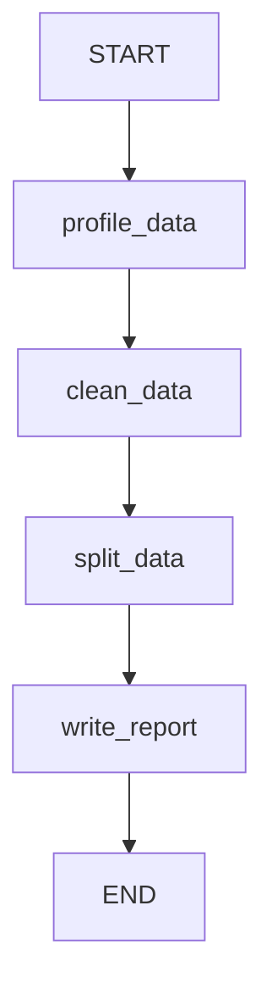

# Analyst Agent

Data profiling, cleaning, splitting, and report generation agent.

## Flow

A linear 4-node pipeline that transforms raw data into clean, split datasets ready for model training.

## Nodes

| Node | LLM Calls | Subprocess | Description |
|------|-----------|------------|-------------|
| `profile_data` | 1 (structured) | 1 (EDA script) | Classifies the ML problem type and runs deterministic EDA. Reads a data sample, uses LLM to detect problem type/target column, then executes the EDA template in a subprocess. |
| `clean_data` | 1 (code gen) | 1 (cleaning script) | Generates a data cleaning script from the data profile (handling missing values, duplicates, encoding), executes it in a subprocess. Falls back to original data on failure. |
| `split_data` | 0 | 1 (split script) | Deterministic train/val/test split (70/15/15 stratified). Zero LLM calls -- generates and executes the split script from problem type and target column. |
| `write_report` | 1 (report gen) | 0 | Synthesizes profiling, cleaning, and splitting results into a comprehensive markdown analysis report. Saves to disk. |

## Input/Output

**Input (from Central/Plan):**
- `objective` -- the ML task description
- `data_file_path` -- path to the raw CSV data file
- `execution_plan` -- structured plan from the plan agent (provides target column, problem type hints)

**Output (to Sklearn):**
- `analysis_report` -- comprehensive markdown report
- `split_data_paths` -- `{"train": path, "val": path, "test": path}`
- `data_profile` -- structured data profile dict (shape, columns, dtypes, missing values, etc.)
- `problem_type` -- classification, regression, clustering, etc.

## Schemas

| Schema | Purpose |
|--------|---------|
| `CleaningAction` | A single cleaning action (action type, column, description) |
| `SplitStatistics` | Train/val/test sample counts and ratios |
| `AnalysisReport` | Structured report: dataset summary, shape, quality issues, cleaning actions, split stats, recommendations |

## Key Files

| File | Purpose |
|------|---------|
| `agent.py` | `AnalystAgent` class wrapping the graph |
| `graph.py` | StateGraph: `profile_data -> clean_data -> split_data -> write_report` |
| `states.py` | `AnalystState` TypedDict with profiling, cleaning, splitting, and report fields |
| `schemas.py` | `CleaningAction`, `SplitStatistics`, `AnalysisReport` Pydantic models |
| `nodes/data_profiler.py` | Problem classification + deterministic EDA |
| `nodes/data_cleaner.py` | LLM-generated cleaning script execution |
| `nodes/data_splitter.py` | Deterministic train/val/test splitting |
| `nodes/report_writer.py` | LLM-generated analysis report |
| `prompts/templates.py` | Classification, cleaning, and report prompts |

## Model

Uses `gemini-3.1-pro-preview` via `get_agent_model("analyst")` for all LLM calls. The pro model handles complex data profiling and generates reliable cleaning code.
