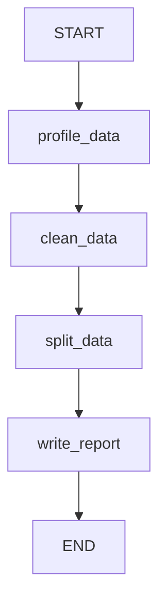

# Analyst Agent

Data profiling, cleaning, splitting, and report generation agent. Receives upstream context from the central orchestrator and validates the problem classification against actual data.

## Flow



A linear 4-node pipeline that transforms raw data into clean, split datasets ready for model training.

## Nodes

| Node | LLM Calls | Subprocess | Description |
|------|-----------|------------|-------------|
| `profile_data` | 1 (structured) | 1 (EDA script) | Validates the upstream classification against actual data (or classifies from scratch if no upstream context). Runs deterministic EDA via subprocess. Returns `classification_confidence` indicating whether the upstream was confirmed, refined, or overridden. |
| `clean_data` | 1 (code gen) | 1 (cleaning script) | Generates a context-aware cleaning script using data profile and upstream `key_considerations` (e.g. class imbalance, high cardinality). Falls back to original data on failure. |
| `split_data` | 0 | 1 (split script) | Adaptive train/val/test split with ratios based on dataset size and task complexity. Zero LLM calls. |
| `write_report` | 1 (report gen) | 0 | Synthesizes profiling, cleaning, splitting, and classification validation results into a markdown analysis report. |

## Input/Output

**Input (from Central Orchestrator):**
- `objective` -- the ML task description
- `data_file_path` -- path to the raw CSV data file
- `experiment_id` -- unique experiment identifier
- `task_analysis` -- upstream `TaskAnalysis` dict (task type, key considerations, recommended approach, complexity estimate, data characteristics)
- `data_description` -- original user dataset description
- `selected_framework` -- framework chosen by the central router (e.g. `"sklearn"`)

**Output (to Plan Agent via PipelineState):**
- `analysis_report` -- comprehensive markdown report
- `split_data_paths` -- `{"train": path, "val": path, "test": path}`
- `data_profile` -- structured data profile dict (shape, columns, dtypes, missing values, etc.)
- `problem_type` -- the validated problem classification (authoritative, data-grounded)
- `classification_confidence` -- `"confirmed"` | `"refined"` | `"overridden"` (feedback signal)
- `classification_reasoning` -- evidence from data supporting the classification decision

## Classification Validation

When `task_analysis` is provided by the central orchestrator, the profiler node validates the upstream classification rather than classifying from scratch:

| Confidence | Meaning |
|-----------|---------|
| `confirmed` | Upstream classification matches what the data shows |
| `refined` | Approximately right but adjusted (e.g. binary vs multiclass, different target column) |
| `overridden` | Upstream is wrong based on actual data evidence |

When `task_analysis` is absent (standalone CLI usage), the profiler falls back to independent classification and always returns `confidence = "confirmed"`.

## Problem-Type-Specific Splitting

Data splitting in `nodes/data_splitter.py` differs significantly by problem type:

### Supervised Tasks (Classification, Regression)

Standard two-stage split producing train/val/test sets:
1. First split: data into train vs. temp (val + test)
2. Second split: temp into val and test
3. Classification uses **stratified splits** (preserving class proportions) when the target column has at least 2 samples per class
4. Regression uses random splits (no stratification)

### Clustering (Unsupervised)

Clustering uses a dedicated `_build_clustering_split_script()`:
- Produces only **train (80%) + test (20%)** -- no validation set
- No target column is used (unsupervised -- no stratification)
- `val_path` is set to `None` in the split statistics
- `val_samples` = 0, `val_ratio` = 0.0

The split function dispatches based on `problem_type == "clustering"` before building the split script.

## Adaptive Split Ratios

Split ratios adapt based on task context (supervised tasks only):

| Condition | Train/Val/Test | Reasoning |
|-----------|---------------|-----------|
| Default / medium complexity | 70/15/15 | Standard |
| High complexity (`task_analysis`) | 60/20/20 | More validation data for reliable model selection |
| Tiny dataset (<200 rows) | 80/10/10 | Preserve training data |
| Guard | >= 60% train | Safety floor |

## Cleaning Behavior by Problem Type

For **supervised tasks**, the cleaning script is informed by the target column and may apply target-aware operations (e.g., avoiding dropping minority class samples for imbalanced classification).

For **clustering**, there is no target column expected. The cleaning script focuses on:
- Handling missing values in feature columns
- Removing or encoding categorical features (distance-based algorithms need numeric input)
- Scaling considerations (important for KMeans, DBSCAN, etc.)
- No stratification-related cleaning (no class distribution to preserve)

## Context-Aware Cleaning

When upstream `task_analysis` is available, the cleaning prompt receives:
- `key_considerations` -- guides decisions (e.g. "class imbalance" prevents dropping minority samples)
- `recommended_approach` -- high-level strategy context
- `complexity_estimate` -- task complexity signal
- `selected_framework` -- framework-specific cleaning (e.g. sklearn needs numeric features)

## Schemas

| Schema | Purpose |
|--------|---------|
| `CleaningAction` | A single cleaning action (action type, column, description) |
| `SplitStatistics` | Train/val/test sample counts and ratios |
| `AnalysisReport` | Structured report: dataset summary, shape, quality issues, cleaning actions, split stats, recommendations |
| `ValidatedClassification` | Classification validation result with confidence, reasoning, and upstream disagreement |

## Examples

`agent.py` includes `EXAMPLES` and a `_run_examples()` entrypoint to validate the agent in isolation:

```bash
uv run python -m scientist_bin_backend.agents.analyst.agent
```

Covers: full pipeline with upstream `task_analysis`, standalone mode (no upstream), override scenario (upstream says regression but data is classification), and high-complexity context without a data file.

## Key Files

| File | Purpose |
|------|---------|
| `agent.py` | `AnalystAgent` class wrapping the graph, plus `EXAMPLES` and `_run_examples()` |
| `graph.py` | StateGraph: `profile_data -> clean_data -> split_data -> write_report` |
| `states.py` | `AnalystState` TypedDict with input context, profiling, cleaning, splitting, and report fields |
| `schemas.py` | `CleaningAction`, `SplitStatistics`, `AnalysisReport`, `ValidatedClassification` Pydantic models |
| `nodes/data_profiler.py` | Dual-path classification (validate upstream or classify from scratch) + deterministic EDA |
| `nodes/data_cleaner.py` | Context-aware LLM-generated cleaning script execution |
| `nodes/data_splitter.py` | Adaptive train/val/test splitting with `_compute_split_ratios()` |
| `nodes/report_writer.py` | LLM-generated analysis report with classification validation context |
| `prompts.py` | `CLASSIFY_PROBLEM_PROMPT`, `VALIDATE_CLASSIFICATION_PROMPT`, `CLEANING_PROMPT`, `REPORT_PROMPT` |

## Model

Uses `gemini-3.1-pro-preview` via `get_agent_model("analyst")` for all LLM calls. The pro model handles complex data profiling and generates reliable cleaning code.
