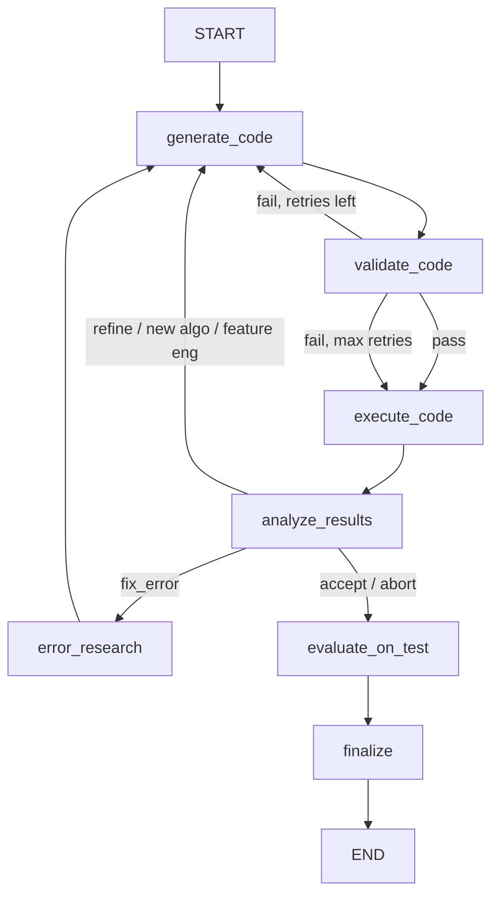

# Base Framework Agent Module

Shared infrastructure for all ML framework subagents: abstract base class, graph builder, reusable nodes, schemas, state, prompts, and utilities. Framework agents extend `BaseFrameworkAgent` and call `build_framework_graph()` with their framework-specific `generate_code` and `error_research` nodes. The base handles the iteration loop, execution, analysis, validation, test evaluation, and finalization.

## Flow

Framework agents inject `generate_code` and optionally `error_research` nodes. All other nodes (`validate_code`, `execute_code`, `analyze_results`, `evaluate_on_test`, `finalize`) are shared.

## Nodes

| Node | File | LLM Calls | Description |
|------|------|-----------|-------------|
| `validate_code` | `nodes/code_validator.py` | 0 | Static analysis: syntax check, import check, results marker, report_metric call. Max 2 retries. |
| `execute_code` | `nodes/code_executor.py` | 0 | Sandboxed subprocess execution with dynamic timeout, metrics streaming, journal logging. |
| `analyze_results` | `nodes/results_analyzer.py` | 0-2 | Parses metrics, decides next action (IMPROVE pattern), structured reflection (ERL). Only increments `current_iteration` on success; error retries use a separate counter. Uses `get_agent_model(fw)` for per-framework model selection. |
| `evaluate_on_test` | `nodes/test_evaluator.py` | 1 | Evaluates best model on held-out test set after iteration loop accepts. |
| `finalize` | `nodes/results_analyzer.py` | 1 | Generates final structured `FinalReport` from best experiment. Uses `get_agent_model(fw)` for per-framework model selection. |

## Input/Output

**Input (via `BaseFrameworkAgent.run()`):**
- `objective` -- the training objective
- `execution_plan` -- structured plan from the plan agent
- `analysis_report` -- markdown report from the analyst agent
- `split_data_paths` -- `{"train": path, "val": path, "test": path}`
- `problem_type` -- classification, regression, clustering, etc.
- `data_profile` -- structured data profile from the analyst agent
- `max_iterations` -- maximum generate-execute-analyze cycles (default 5)
- `experiment_id` -- unique experiment identifier

**Output (returned by `run()`):**
- `plan` -- the strategy dict (derived from execution_plan)
- `generated_code` -- final training script
- `evaluation_results` -- best experiment record (metrics, hyperparameters)
- `experiment_history` -- list of all iteration records
- `iterations` -- number of completed iterations
- `test_metrics` -- metrics from held-out test set evaluation
- `test_evaluation_code` -- test evaluation script for reproducibility
- `test_diagnostics` -- enriched test results (confusion matrix, residual stats, cluster profiles)
- `hyperparameters_summary` -- summary of hyperparameter configurations tried

## Error Retry Separation

Error retries are tracked independently from the optimization budget:

- `error_retry_count` -- consecutive failed execution attempts (resets to 0 on success)
- `max_error_retries` -- max error fix attempts per approach (default 3)
- `current_iteration` -- only incremented on **successful** execution

When code execution fails, `analyze_results` increments `error_retry_count` without touching `current_iteration`. If retries are exhausted (`error_retry_count >= max_error_retries`), the agent moves to a new algorithm or aborts. On success, `error_retry_count` resets and `current_iteration` advances. This ensures runtime errors don't consume the limited optimization budget.

Error retry events (`error_retry`) are emitted via the event bus for frontend visibility (e.g., progress indicators showing retry status).

## Schemas

| Schema | Purpose |
|--------|---------|
| `ProblemClassification` | Structured classification output: problem type, reasoning, target column guess, suggested metrics |
| `StrategyPlan` | Structured plan: approach summary, candidate algorithms, preprocessing steps, feature engineering, CV strategy, success criteria |
| `IterationDecision` | LLM decision after analysis: action (accept/refine/new_algo/fix_error/feature_engineer/abort), reasoning, refinement instructions, confidence |
| `FinalReport` | Final output: best model, best metrics, total iterations, interpretation, recommendations |
| `AlgorithmCandidate` | A candidate algorithm with hyperparameter search space and priority |
| `PreprocessingStep` | A data preprocessing step with target columns |
| `FeatureEngineeringStep` | A feature engineering operation with new feature names |

## Examples

The base module is an abstract class -- it has no standalone `EXAMPLES`. Framework agents that extend it include their own examples for isolated validation. See:

- `frameworks/sklearn/README.md` -- sklearn agent examples
- `frameworks/flaml/README.md` -- FLAML agent examples

## Key Files

| File | Purpose |
|------|---------|
| `agent.py` | `BaseFrameworkAgent` ABC with shared `run()` interface |
| `graph.py` | `build_framework_graph()` shared graph builder, `_route_decision`, `_route_validation` |
| `states.py` | `BaseMLState` (incl. `framework_name`, `error_retry_count`, `max_error_retries`), `DataProfile`, `ExperimentRecord` TypedDicts |
| `schemas.py` | `ProblemClassification`, `StrategyPlan`, `IterationDecision`, `FinalReport` |
| `prompts.py` | Prompts for results analysis, reflection, final report, test evaluation |
| `utils.py` | `strip_code_fences()` utility for cleaning LLM code output |
| `nodes/code_validator.py` | `validate_code` node + individual check functions |
| `nodes/code_executor.py` | `execute_code` node (0 LLM calls, subprocess sandbox) |
| `nodes/results_analyzer.py` | `analyze_results`, `finalize` nodes |
| `nodes/test_evaluator.py` | `evaluate_on_test` node + `_parse_test_results` helper |

## Model

The base module does not select a model directly. Each framework agent provides its own model via `get_agent_model(framework_name)`. The `analyze_results` and `finalize` nodes call `get_agent_model(state["framework_name"])` at runtime to use the framework-specific model.
