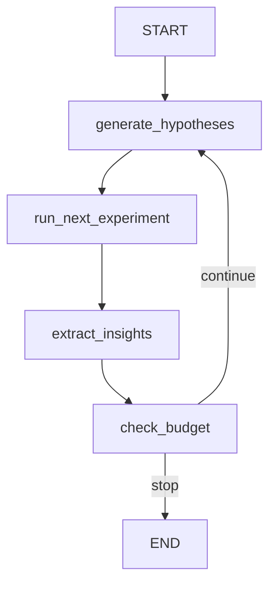

# Campaign Orchestrator Agent

Autonomous research campaign that wraps the 5-agent pipeline in an iterative loop. Generates hypotheses, runs experiments, extracts insights, and continues until the budget is exhausted or results converge.

## Flow



A 4-node loop with 2 LLM calls per iteration (hypothesis generation + insight extraction) plus the inner pipeline execution.

## Nodes

| Node | LLM Calls | Description |
|------|-----------|-------------|
| `generate_hypotheses` | 1 (structured) | Produces a ranked `HypothesisList` based on the objective, data profile, and accumulated findings memory. Queries `FindingsStore` for cross-campaign learnings. Balances exploitation with exploration. |
| `run_next_experiment` | 0 (delegates) | Picks the top-ranked hypothesis, builds a `TrainRequest`, and invokes a fresh `CentralAgent` for the full 5-agent pipeline. Runs with `auto_approve_plan=True`. Failures are caught and logged (not fatal). |
| `extract_insights` | 1 | Analyzes the latest experiment result, produces an updated findings summary, and persists to `FindingsStore` for cross-campaign learning. |
| `check_budget` | 0 | Split into `check_budget_node` (state update: writes `campaign_status`) and `route_budget` (routing function: returns `"continue"` or `"stop"`). Both check iteration count and wall-clock time. |

## CLI Usage

```bash
# Run a campaign with default settings (10 experiments, 4h time limit)
uv run scientist-bin campaign "Find the best classifier for iris species" \
    --data-file data/iris_data/Iris.csv

# Custom budget
uv run scientist-bin campaign "Predict house prices" \
    --data-file data/housing/train.csv \
    --budget 5 --time-limit 1h

# With data description
uv run scientist-bin campaign "Segment customers" \
    --data-file data/customers.csv \
    --data "10k customers, 20 features" \
    --budget 8 --time-limit 2h
```

The `--time-limit` flag accepts human-readable durations: `4h`, `30m`, `300s`.

## Budget Management

Two hard constraints control the campaign loop (checked in `check_budget`):

| Constraint | Default | Flag |
|---|---|---|
| Max iterations | 10 | `--budget` |
| Wall-clock time | 4 hours (14400s) | `--time-limit` |

The budget checker is split into two functions:

- `check_budget_node(state)` -- LangGraph node that evaluates budget and writes `campaign_status` to state (`"budget_exhausted"` or `"running"`)
- `route_budget(state)` -- pure routing function for the conditional edge (`"continue"` or `"stop"`)

Both use shared `_evaluate_budget()` logic: compare `current_iteration` against `budget_max_iterations` and elapsed time against `budget_time_limit_seconds`. When either limit is reached, the campaign stops.

A convergence check prompt (`CONVERGENCE_CHECK_PROMPT`) is defined in `prompts.py` for future LLM-based convergence detection (evaluating diminishing returns), but is not yet wired into the budget checker.

## Findings Memory Integration

The campaign maintains a cumulative `findings_summary` string that serves as long-term memory across iterations:

1. After each experiment, `extract_insights` analyzes the result in context of existing findings
2. The LLM produces an updated findings summary integrating new learnings
3. `generate_hypotheses` receives the findings summary to avoid re-proposing tested hypotheses and to target weaknesses revealed by prior experiments

Example findings: "Feature X has high importance", "Logistic Regression overfits at C > 10", "SMOTE did not help -- try class_weight instead".

For persistent cross-campaign memory, see the `memory/` module (`FindingsStore` with ChromaDB).

### FindingsStore Integration

The campaign now actively uses `FindingsStore` in two nodes:

1. **`generate_hypotheses`** -- queries `FindingsStore.query_similar()` to retrieve relevant past findings and injects them as "Cross-Campaign Findings" context into the hypothesis generation prompt
2. **`extract_insights`** -- calls `FindingsStore.add_finding()` to persist each experiment's results (algorithm, metrics, insights) for future campaigns

Both operations degrade gracefully if ChromaDB is not installed.

## Checkpointing

The campaign graph uses LangGraph `MemorySaver` for state persistence:

- A `thread_id` (random hex) is assigned at campaign start
- `MemorySaver` is the default checkpointer (in-memory)
- A custom checkpointer can be passed to `CampaignAgent(checkpointer=...)` for persistent storage
- This enables campaign resumability after interruption

## Experiment Runner

The `run_next_experiment` node (`nodes/experiment_runner.py`) invokes the full 5-agent pipeline for each hypothesis:

1. Picks the top-ranked hypothesis from `hypotheses`
2. Builds a `TrainRequest` with the hypothesis baked into the objective and `auto_approve_plan=True`
3. Instantiates a fresh `CentralAgent` and calls `agent.run()`
4. Extracts results (experiment_id, best_model, metrics, status, etc.)
5. Updates `completed_experiments`, `current_iteration`, and `best_result`
6. Handles errors gracefully -- failed experiments are logged and recorded but don't stop the campaign

## Schemas

| Schema | Purpose |
|--------|---------|
| `Hypothesis` | Single hypothesis: description, approach, algorithm suggestions, feasibility/novelty scores, rationale |
| `HypothesisList` | Structured output from hypothesis generation (ranked list) |
| `CampaignResult` | Final campaign output: total iterations, timing, best experiment, key findings |

## Examples

```bash
uv run python -m scientist_bin_backend.agents.campaign.agent
```

Covers: iris classification (2 iterations) and house price regression (3 iterations).

## Key Files

| File | Purpose |
|------|---------|
| `agent.py` | `CampaignAgent` class wrapping the graph + `EXAMPLES` + `_run_examples()` |
| `graph.py` | StateGraph: 4-node loop with conditional edge back to `generate_hypotheses` |
| `states.py` | `CampaignState` TypedDict with budget, hypothesis, results, and findings fields |
| `schemas.py` | `Hypothesis`, `HypothesisList`, `CampaignResult` Pydantic models |
| `prompts.py` | `HYPOTHESIS_GENERATION_PROMPT`, `INSIGHT_EXTRACTION_PROMPT`, `CONVERGENCE_CHECK_PROMPT` |
| `nodes/hypothesis_generator.py` | Ranked hypothesis generation (1 structured LLM call) + FindingsStore query |
| `nodes/experiment_runner.py` | Inner pipeline invocation via `CentralAgent` |
| `nodes/insight_extractor.py` | Findings memory update (1 LLM call) + FindingsStore write |
| `nodes/budget_checker.py` | `check_budget_node` (state update) + `route_budget` (routing function) |

## Model

Uses `get_agent_model("campaign")` for LLM calls in hypothesis generation and insight extraction.
