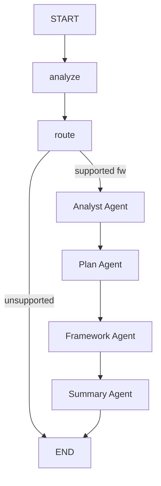

# Central Agent

Orchestrator agent that coordinates the full 5-agent training pipeline.

## Flow



The central agent produces a structured `TaskAnalysis`, routes to the selected framework pipeline, then delegates to four downstream agents in sequence:
1. **Analyst Agent** -- profiles, cleans, and splits the data. Receives `task_analysis`, `data_description`, and `selected_framework` from the orchestrator to validate the upstream classification and make context-aware cleaning/splitting decisions.
2. **Plan Agent** -- generates and reviews an execution plan (HITL), enriched with upstream `task_analysis`, `data_profile`, and analyst `classification_confidence`.
3. **Framework Agent** -- generic delegate that dynamically loads the selected framework agent (e.g. sklearn) via `FRAMEWORK_REGISTRY`.
4. **Summary Agent** -- reviews experiments and generates a final report.

## Nodes

| Node | LLM Calls | Description |
|------|-----------|-------------|
| `analyze` | 1 (structured) | Produces a structured `TaskAnalysis` (task type, data characteristics, suggested frameworks) via `with_structured_output(TaskAnalysis)` |
| `route` | 0-1 | Selects framework: deterministic first (user preference or `task_analysis.suggested_frameworks`), LLM fallback for ambiguous cases. Contains `FRAMEWORK_REGISTRY` mapping framework names to agent class paths |
| `_analyst_delegate` | delegate | Instantiates `AnalystAgent`, passes objective/data file + upstream `task_analysis`, `data_description`, `selected_framework`. Returns `analysis_report`, `split_data_paths`, `problem_type`, `data_profile`, `classification_confidence`, `classification_reasoning` |
| `_plan_delegate` | delegate | Instantiates `PlanAgent`, passes objective/data + upstream `task_analysis` + analyst outputs (`analysis_report`, `data_profile`, `problem_type`). Returns `execution_plan`, `plan_approved`, `plan_markdown` |
| `_framework_delegate` | delegate | Generic: reads `selected_framework`, looks up agent class in `FRAMEWORK_REGISTRY`, dynamically imports and invokes it. Returns `framework_results` |
| `_summary_delegate` | delegate | Instantiates `SummaryAgent`, passes all upstream results. Returns `summary_report` and assembled `agent_response` |

## Input/Output

**Input (from CLI / API via `TrainRequest`):**
- `objective` -- the ML task description
- `data_file_path` -- path to the dataset CSV file
- `data_description` -- free-text dataset description
- `framework_preference` -- optional user framework preference (e.g. `"sklearn"`)
- `auto_approve_plan` -- whether to skip HITL plan review

**Output (`AgentResponse`):**
- `framework` -- framework used (e.g. `"sklearn"`)
- `plan` -- the execution plan dict
- `generated_code` -- final training script
- `evaluation_results` -- best experiment metrics and hyperparameters
- `experiment_history` -- list of all iteration records
- `analysis_report` -- markdown data analysis report
- `summary_report` -- markdown summary report
- `best_model` -- name of the best algorithm
- `test_metrics` -- held-out test set metrics
- `status` -- `"success"` or `"error"`

**State architecture:** `CentralState` holds the orchestrator's own fields (analyze + route nodes). `PipelineState(CentralState)` extends it with all downstream agent outputs (`analysis_report`, `execution_plan`, `framework_results`, `summary_report`, etc.).

## Data Flow: Orchestrator --> Analyst --> Plan

```
Central Orchestrator
  analyze --> TaskAnalysis {task_type, key_considerations, recommended_approach, ...}
  route   --> selected_framework
      |
      | objective, data_file_path, experiment_id
      | + task_analysis, data_description, selected_framework
      v
Analyst Agent
  profile_data --> ValidatedClassification {problem_type, confidence, reasoning}
  clean_data   --> cleaned.csv (informed by key_considerations + framework)
  split_data   --> train/val/test (adaptive ratios based on complexity + dataset size)
  write_report --> analysis_report.md
      |
      | analysis_report, split_data_paths, data_profile, problem_type
      | + classification_confidence, classification_reasoning
      v
Plan Agent
  research    --> web search using problem_type + data_profile context
  write_plan  --> uses analysis_report + data_profile + search_results
  save_plan   --> persists execution_plan.json to disk
```

## Problem Type Detection

The analyzer node uses `TaskAnalysis.task_type` (a `Literal` enum) to classify the request into one of five categories:

| Task Type | Examples | Downstream Behavior |
|---|---|---|
| `classification` | Iris species, spam detection, churn prediction | Stratified splits, confusion matrix, F1/AUC metrics |
| `regression` | House prices, sales forecast, temperature prediction | Random splits, residual analysis, MAE/RMSE/R2 |
| `clustering` | Customer segmentation, document grouping | No target column, train/test only, silhouette/elbow metrics |
| `dimensionality_reduction` | Feature reduction, visualization | Currently routes to sklearn |
| `anomaly_detection` | Fraud detection, sensor anomalies | Currently routes to sklearn |

The `task_subtype` field provides further detail (e.g., `"binary"`, `"multiclass"`, `"multi-label"`, `"ordinal"` for classification). The analyst agent then validates this classification against the actual data.

## Framework Registry and Delegation

The router node (`nodes/router.py`) contains `FRAMEWORK_REGISTRY`, a dict mapping framework names to fully-qualified agent class paths:

```python
FRAMEWORK_REGISTRY = {
    "sklearn": "scientist_bin_backend.agents.frameworks.sklearn.agent.SklearnAgent",
    # "pytorch": "...",  (planned)
}
```

The generic `_framework_delegate` in `graph.py` reads `selected_framework` from state, looks up the class path in the registry, dynamically imports it, and invokes the agent. This means adding a new framework requires only one registry entry plus the agent implementation.

Framework selection follows a 3-tier priority:
1. **User preference** -- if `framework_preference` matches a supported framework, use it directly
2. **Task analysis** -- pick the first supported framework from `task_analysis.suggested_frameworks`
3. **LLM fallback** -- ask the LLM to select when the above are ambiguous

## Schemas

| Schema | Purpose |
|--------|---------|
| `TrainRequest` | Incoming training request from user/CLI (objective, data file, framework preference) |
| `TaskAnalysis` | Structured analysis output: task type, subtype, complexity, key considerations, suggested frameworks, data characteristics |
| `DataCharacteristics` | Inferred data shape, types, target column hints (nested in `TaskAnalysis`) |
| `FrameworkSelection` | Router output: selected framework + reasoning |
| `AgentResponse` | Final pipeline output assembling all agent results into a single response dict |

## Examples

`agent.py` includes `EXAMPLES` and a `_run_examples()` entrypoint to validate the analyze + route nodes in isolation:

```bash
uv run python -m scientist_bin_backend.agents.central.agent
```

Covers: iris classification, house price regression, customer segmentation (clustering), fraud detection (imbalanced binary), and a text classification request with framework preference.

## Key Files

| File | Purpose |
|------|---------|
| `states.py` | `CentralState` + `PipelineState` TypedDicts |
| `schemas.py` | `TrainRequest`, `TaskAnalysis`, `DataCharacteristics`, `FrameworkSelection`, `AgentResponse` |
| `graph.py` | StateGraph: `analyze -> route -> analyst -> plan -> framework -> summary -> END` |
| `agent.py` | `CentralAgent` class wrapping the graph, plus `EXAMPLES` and `_run_examples()` |
| `utils.py` | `build_initial_state()` helper |
| `nodes/analyzer.py` | Structured task analysis node |
| `nodes/router.py` | Framework selection + `FRAMEWORK_REGISTRY` |
| `prompts.py` | Analyzer and router prompt templates |

## Model

Uses `gemini-3-flash-preview` via `get_agent_model("central")` for the analyze and route nodes. The flash model is sufficient for task classification and framework routing.
