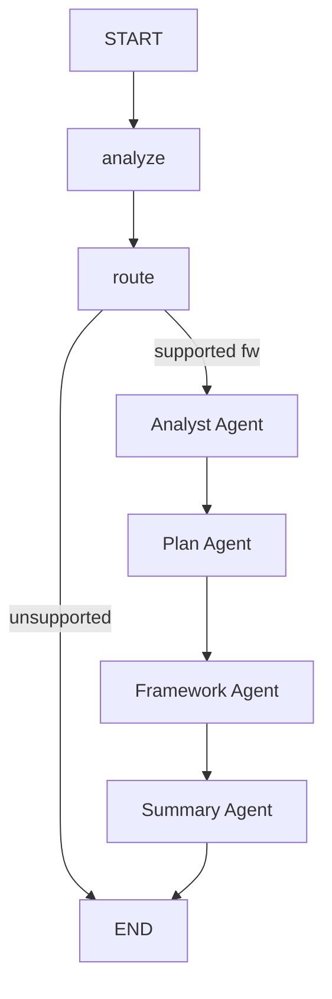

# Central Agent

Orchestrator agent that coordinates the full 5-agent training pipeline.

## Flow



The central agent produces a structured `TaskAnalysis`, routes to the selected framework pipeline, then delegates to four downstream agents in sequence:
1. **Analyst Agent** -- profiles, cleans, and splits the data. Receives `task_analysis`, `data_description`, and `selected_framework` from the orchestrator to validate the upstream classification and make context-aware cleaning/splitting decisions.
2. **Plan Agent** -- generates and reviews an execution plan (HITL), enriched with upstream `task_analysis`, `data_profile`, and analyst `classification_confidence`.
3. **Framework Agent** -- generic delegate that dynamically loads the selected framework agent (e.g. sklearn) via `FRAMEWORK_REGISTRY`.
4. **Summary Agent** -- reviews experiments and generates a final report.

## Nodes

- `analyzer.py` -- Produces a structured `TaskAnalysis` (task type, data characteristics, suggested frameworks) via `with_structured_output(TaskAnalysis)`.
- `router.py` -- Selects framework: deterministic first (user preference or `task_analysis.suggested_frameworks`), LLM fallback for ambiguous cases. Contains `FRAMEWORK_REGISTRY` mapping framework names to agent class paths.

## Delegate Nodes (in `graph.py`)

- `_analyst_delegate` -- Instantiates `AnalystAgent`, passes objective/data file + upstream `task_analysis`, `data_description`, `selected_framework`. Returns `analysis_report`, `split_data_paths`, `problem_type`, `data_profile`, `classification_confidence`, `classification_reasoning`.
- `_plan_delegate` -- Instantiates `PlanAgent`, passes objective/data + upstream `task_analysis` + analyst outputs (`analysis_report`, `data_profile`, `problem_type`), returns `execution_plan`, `plan_approved`, `plan_markdown`.
- `_framework_delegate` -- Generic: reads `selected_framework`, looks up agent class in `FRAMEWORK_REGISTRY`, dynamically imports and invokes it. Returns `framework_results`.
- `_summary_delegate` -- Instantiates `SummaryAgent`, passes all upstream results, returns `summary_report` and assembled `agent_response`.

## State

- `CentralState` -- Central agent's own fields (analyze + route nodes): objective, data_description, task_analysis, selected_framework, etc.
- `PipelineState(CentralState)` -- Extended state for the full pipeline, adds downstream agent outputs (analysis_report, execution_plan, framework_results, summary_report, classification_confidence, classification_reasoning, etc.).

## Data Flow: Orchestrator --> Analyst --> Plan

```
Central Orchestrator
  analyze --> TaskAnalysis {task_type, key_considerations, recommended_approach, ...}
  route   --> selected_framework
      |
      | objective, data_file_path, experiment_id
      | + task_analysis, data_description, selected_framework
      v
Analyst Agent
  profile_data --> ValidatedClassification {problem_type, confidence, reasoning}
  clean_data   --> cleaned.csv (informed by key_considerations + framework)
  split_data   --> train/val/test (adaptive ratios based on complexity + dataset size)
  write_report --> analysis_report.md
      |
      | analysis_report, split_data_paths, data_profile, problem_type
      | + classification_confidence, classification_reasoning
      v
Plan Agent
  query_rewriter --> uses task_analysis + data_profile + problem_type
  plan_writer    --> uses analysis_report + data_profile + search_results
```

## Examples

`agent.py` includes `EXAMPLES` and a `_run_examples()` entrypoint to validate the analyze + route nodes in isolation:

```bash
uv run python -m scientist_bin_backend.agents.central.agent
```

Covers: iris classification, house price regression, customer segmentation (clustering), fraud detection (imbalanced binary), and a text classification request with framework preference.

## Key Files

| File | Purpose |
|------|---------|
| `states.py` | `CentralState` + `PipelineState` TypedDicts |
| `schemas.py` | `TrainRequest`, `TaskAnalysis`, `DataCharacteristics`, `FrameworkSelection`, `AgentResponse` |
| `graph.py` | StateGraph: `analyze -> route -> analyst -> plan -> framework -> summary -> END` |
| `agent.py` | `CentralAgent` class wrapping the graph, plus `EXAMPLES` and `_run_examples()` |
| `utils.py` | `build_initial_state()` helper |
| `nodes/analyzer.py` | Structured task analysis node |
| `nodes/router.py` | Framework selection + `FRAMEWORK_REGISTRY` |
| `prompts.py` | Analyzer and router prompt templates |
