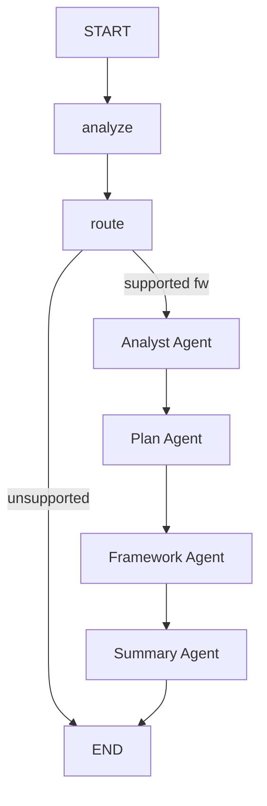

# Central Agent

Orchestrator agent that coordinates the full 5-agent training pipeline.

## Flow

The central agent produces a structured `TaskAnalysis`, routes to the selected framework pipeline, then delegates to four downstream agents in sequence:
1. **Analyst Agent** -- profiles, cleans, and splits the data (runs first so the plan has real data characteristics)
2. **Plan Agent** -- generates and reviews an execution plan (HITL), enriched with upstream `task_analysis` and `data_profile`
3. **Framework Agent** -- generic delegate that dynamically loads the selected framework agent (e.g. sklearn) via `FRAMEWORK_REGISTRY`
4. **Summary Agent** -- reviews experiments and generates a final report

## Nodes

- `analyzer.py` -- Produces a structured `TaskAnalysis` (task type, data characteristics, suggested frameworks) via `with_structured_output(TaskAnalysis)`.
- `router.py` -- Selects framework: deterministic first (user preference or `task_analysis.suggested_frameworks`), LLM fallback for ambiguous cases. Contains `FRAMEWORK_REGISTRY` mapping framework names to agent class paths.

## Delegate Nodes (in `graph.py`)

- `_analyst_delegate` -- Instantiates `AnalystAgent`, passes objective/data file, returns `analysis_report`, `split_data_paths`, `problem_type`, `data_profile`.
- `_plan_delegate` -- Instantiates `PlanAgent`, passes objective/data + upstream `task_analysis` + analyst outputs (`analysis_report`, `data_profile`, `problem_type`), returns `execution_plan`, `plan_approved`, `plan_markdown`.
- `_framework_delegate` -- Generic: reads `selected_framework`, looks up agent class in `FRAMEWORK_REGISTRY`, dynamically imports and invokes it. Returns `framework_results`.
- `_summary_delegate` -- Instantiates `SummaryAgent`, passes all upstream results, returns `summary_report` and assembled `agent_response`.

## State

- `CentralState` -- Central agent's own fields (analyze + route nodes): objective, data_description, task_analysis, selected_framework, etc.
- `PipelineState(CentralState)` -- Extended state for the full pipeline, adds downstream agent outputs (analysis_report, execution_plan, framework_results, summary_report, etc.).

## Key Files

| File | Purpose |
|------|---------|
| `states.py` | `CentralState` + `PipelineState` TypedDicts |
| `schemas.py` | `TrainRequest`, `TaskAnalysis`, `DataCharacteristics`, `FrameworkSelection`, `AgentResponse` |
| `graph.py` | StateGraph: `analyze -> route -> analyst -> plan -> framework -> summary -> END` |
| `agent.py` | `CentralAgent` class wrapping the graph |
| `utils.py` | `build_initial_state()` helper |
| `nodes/analyzer.py` | Structured task analysis node |
| `nodes/router.py` | Framework selection + `FRAMEWORK_REGISTRY` |
| `prompts.py` | Analyzer and router prompt templates |
