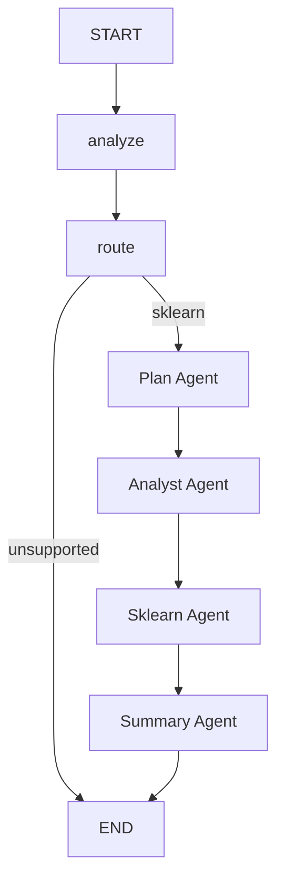

# Central Agent

Orchestrator agent that coordinates the full 5-agent training pipeline.

## Flow

The central agent delegates to four downstream agents in sequence:
1. **Plan Agent** -- generates and reviews an execution plan (HITL)
2. **Analyst Agent** -- profiles, cleans, and splits the data
3. **Sklearn Agent** -- iteratively trains and evaluates models
4. **Summary Agent** -- reviews experiments and generates a final report

## Nodes

- `analyzer.py` -- Analyzes the training request to determine task type and data characteristics. Uses `get_agent_model("central")`.
- `router.py` -- Selects the appropriate framework subagent via structured LLM output. Currently supports `sklearn`; unsupported frameworks route to END.

## Delegate Nodes (in `graph.py`)

- `_plan_delegate` -- Instantiates `PlanAgent`, passes objective/data/framework, returns `execution_plan`, `plan_approved`, `plan_markdown`.
- `_analyst_delegate` -- Instantiates `AnalystAgent`, passes objective/data/plan, returns `analysis_report`, `split_data_paths`, `problem_type`, `data_profile`.
- `_sklearn_delegate` -- Instantiates `SklearnAgent`, passes plan/data/profile, returns `sklearn_results`.
- `_summary_delegate` -- Instantiates `SummaryAgent`, passes all upstream results, returns `summary_report` and assembled `agent_response`.

## Key Files

| File | Purpose |
|------|---------|
| `states.py` | `CentralState` TypedDict with pipeline outputs flowing between agents |
| `schemas.py` | `TrainRequest` (with `auto_approve_plan`), `FrameworkSelection`, `AgentResponse` |
| `graph.py` | StateGraph: `analyze -> route -> plan -> analyst -> sklearn -> summary -> END` |
| `agent.py` | `CentralAgent` class wrapping the graph |
| `utils.py` | `build_initial_state()` helper |
| `nodes/analyzer.py` | Request analysis node |
| `nodes/router.py` | Framework selection node with `SUPPORTED_FRAMEWORKS` set |
| `prompts/templates.py` | Analyzer and router prompt templates |
