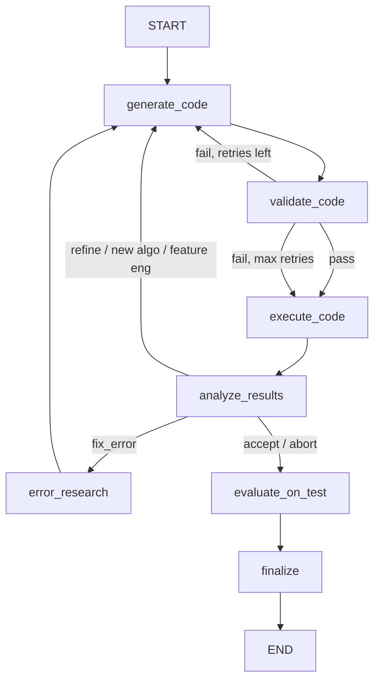

# FLAML AutoML Framework Agent

Automated model selection and hyperparameter tuning using [FLAML (Fast and Lightweight AutoML)](https://github.com/microsoft/FLAML) by Microsoft Research. Generates self-contained FLAML training scripts, executes them in a sandbox, and iteratively refines the approach.

Lives under `agents/frameworks/flaml/` and extends `BaseFrameworkAgent` from `agents/base/`.

## Flow



The FLAML agent inherits the full iteration loop from `build_framework_graph()`. Unlike sklearn, FLAML handles model selection and hyperparameter tuning automatically within a time budget, so generated code configures `flaml.AutoML` rather than building sklearn pipelines.

## Nodes

| Node | LLM Calls | Source | Description |
|------|-----------|--------|-------------|
| `generate_code` | 1 | `frameworks/flaml/nodes/` | Generates FLAML AutoML code using execution plan, split data paths, analysis report, and skill reference |
| `validate_code` | 0 | `base/nodes/` | Static analysis: syntax check, import check, results marker, report_metric |
| `execute_code` | 0 | `base/nodes/` | Sandboxed subprocess execution with timeout enforcement |
| `analyze_results` | 0-1 | `base/nodes/` | Parses metrics, decides next action, writes to experiment journal |
| `error_research` | 1 (search) | `frameworks/flaml/nodes/` | Uses Google Search grounding to find solutions for FLAML execution errors |
| `evaluate_on_test` | 1 | `base/nodes/` | Evaluates best model on held-out test set |
| `finalize` | 1 | `base/nodes/` | Generates final report |

## Input/Output

**Input (from Plan + Analyst):**
- `execution_plan` -- structured plan with time_budget, estimator_list, metrics, success criteria
- `split_data_paths` -- `{"train": path, "val": path, "test": path}`
- `analysis_report` -- markdown report from the analyst agent
- `data_profile` -- structured data profile (shape, columns, dtypes, etc.)
- `problem_type` -- classification, regression, ts_forecast

**Output (to Summary Agent via PipelineState):**
- `generated_code` -- final FLAML training script
- `experiment_history` -- list of per-iteration experiment records (with FLAML-specific enrichments)
- `best_experiment` -- the highest-scoring experiment record
- `test_metrics` -- metrics from held-out test set evaluation
- `test_evaluation_code` -- the test evaluation script for reproducibility
- `test_diagnostics` -- enriched test results (confusion matrix, residual stats, forecast data)

## Supported Problem Types

| Problem Type | FLAML Task | Default Estimators | Default Metric |
|-------------|------------|-------------------|----------------|
| Classification | `classification` | lgbm, xgboost, xgb_limitdepth, rf, extra_tree, lrl1 | accuracy |
| Regression | `regression` | lgbm, rf, xgboost, extra_tree | r2 |
| Time Series Forecasting | `ts_forecast` | lgbm, xgboost, rf, extra_tree, prophet, arima, sarimax | mape |

### Prompt Routing Logic

In `nodes/code_generator.py`, the `generate_code` node selects the prompt based on `state["problem_type"]`:

1. `problem_type == "ts_forecast"` -- uses `FLAML_TS_FORECAST_PROMPT` (temporal column handling, forecast horizon)
2. `problem_type == "regression"` -- uses `FLAML_REGRESSION_PROMPT` (holdout validation, residual analysis)
3. All other types (including classification) -- uses `FLAML_CLASSIFICATION_PROMPT` (holdout validation, confusion matrix)

### FLAML-Specific Output Enrichments

Generated code outputs `===RESULTS===` JSON with standard metrics plus FLAML-specific fields:

- `trial_history` -- all FLAML trials with configs and losses
- `best_estimator_type` -- the winning estimator name
- `estimator_comparison` -- best config/loss per estimator type
- `forecast_data` -- (time series only) actual vs predicted with timestamps

## Skills

Modular skill definitions providing problem-type-specific estimator guidance, metric selection, and code patterns:

```
skills/
├── classification/
│   ├── SKILL.md          — Metadata + when-to-use
│   └── reference.md      — Estimator comparison, metric guidance, code template
├── regression/
│   ├── SKILL.md
│   └── reference.md      — Regression estimators, residual analysis enrichments
└── ts_forecast/
    ├── SKILL.md
    └── reference.md      — Temporal column handling, forecast-specific gotchas
```

Skill references are loaded via `skill_loader` and injected into the code generation prompt as a `== SKILL REFERENCE ==` block (max 10,000 chars).

## Schemas

| Schema | Purpose |
|--------|---------|
| `FlamlStrategyPlan` | FLAML-specific plan: time_budget (default 120s), estimator_list, metric, ts_period (forecast horizon), eval_method (auto/cv/holdout), n_splits (default 5) |

## Examples

`agent.py` includes `EXAMPLES` and a `_run_examples()` entrypoint to validate the agent in isolation:

```bash
uv run python -m scientist_bin_backend.agents.frameworks.flaml.agent
```

Covers: iris classification (AutoML, 60s budget), housing regression (AutoML, 120s budget), and airline passengers time series forecasting (120s budget, period=12).

## Key Files

| File | Purpose |
|------|---------|
| `agent.py` | `FlamlAgent(BaseFrameworkAgent)` with `EXAMPLES` + `_run_examples()` |
| `states.py` | `FlamlState(BaseMLState)` -- adds `time_budget`, `estimator_list`, `flaml_metric`, `ts_period` |
| `schemas.py` | `FlamlStrategyPlan` extending base `StrategyPlan` |
| `nodes/code_generator.py` | FLAML code generation with prompt routing, skill reference injection, and default estimator/metric tables |
| `nodes/error_researcher.py` | Web search for FLAML error resolution via `search_with_gemini()` |
| `prompts.py` | `FLAML_CLASSIFICATION_PROMPT`, `FLAML_REGRESSION_PROMPT`, `FLAML_TS_FORECAST_PROMPT` |

## Model

Uses `gemini-3.1-pro-preview` via `get_agent_model("flaml")` for code generation. The pro model handles complex AutoML code generation and configuration. Error research uses Google Search grounding via `search_with_gemini()`.
