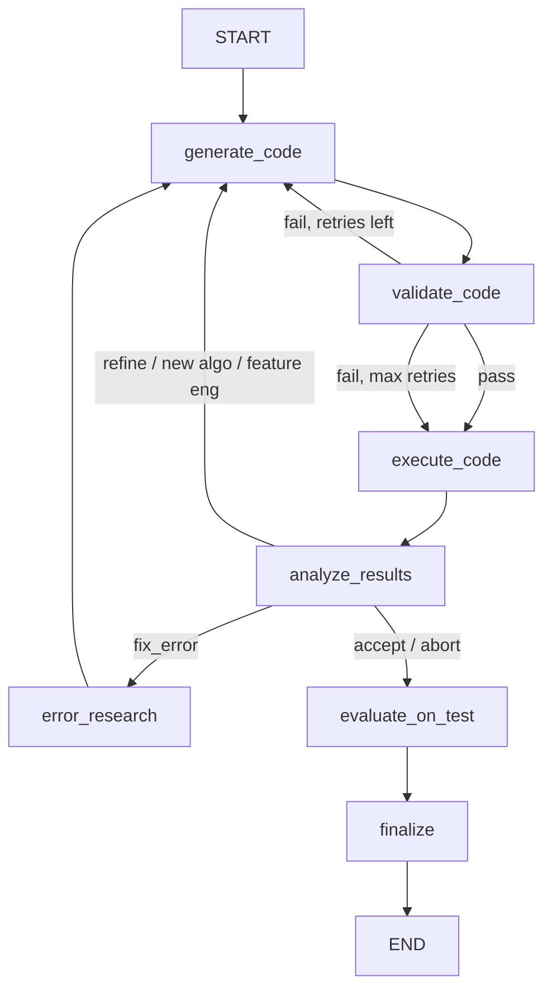

# Sklearn Subagent

Scikit-learn framework subagent that iteratively generates training code, executes it in a sandbox, analyzes results, and refines the approach.

Lives under `agents/frameworks/sklearn/` and extends `BaseFrameworkAgent` from `agents/base/`.

## Flow



The sklearn agent receives pre-built execution plans and split data from the upstream plan and analyst agents. It focuses purely on the generate-validate-execute-analyze iteration loop.

### Iteration Loop

After `analyze_results`, the agent decides:
- **accept** / **abort** -- evaluate on held-out test set, then finalize and produce report
- **fix_error** -- web search for error resolution, then regenerate code
- **refine_params** -- adjust hyperparameters (one at a time, IMPROVE pattern)
- **try_new_algo** -- switch algorithm family
- **feature_engineer** -- add feature transformations

Max 5 iterations by default. Deterministic budget limits (wall time, iteration count) stop runaway loops without LLM calls.

### Pre-execution Validation

Generated code passes through `validate_code` (base node, zero LLM tokens) before execution. Checks: syntax, import availability, `===RESULTS===` marker, `report_metric()` call. Max 2 validation retries before proceeding to execution anyway.

### Test Evaluation

After accepting a model, `evaluate_on_test` (base node) evaluates the best model on the held-out test set. This produces `test_metrics` passed to the summary agent.

## Nodes

| Node | LLM Calls | Source | Description |
|------|-----------|--------|-------------|
| `generate_code` | 1 | `frameworks/sklearn/nodes/` | Generates complete sklearn code using execution plan, split data paths, analysis report, and experiment history |
| `validate_code` | 0 | `base/nodes/` | Static analysis: syntax check, import check, results marker, report_metric |
| `execute_code` | 0 | `base/nodes/` | Sandboxed subprocess execution with timeout enforcement |
| `analyze_results` | 0-1 | `base/nodes/` | Parses metrics, decides next action, writes to experiment journal |
| `error_research` | 1 (search) | `frameworks/sklearn/nodes/` | Uses Google Search grounding to find solutions for execution errors |
| `evaluate_on_test` | 1 | `base/nodes/` | Evaluates best model on held-out test set |
| `finalize` | 1 | `base/nodes/` | Generates final report |

## Input/Output

**Input (from Plan + Analyst):**
- `execution_plan` -- structured plan with algorithms, preprocessing, metrics, success criteria
- `split_data_paths` -- `{"train": path, "val": path, "test": path}`
- `analysis_report` -- markdown report from the analyst agent
- `data_profile` -- structured data profile (shape, columns, dtypes, etc.)
- `problem_type` -- classification, regression, clustering, etc.

**Output (to Summary Agent via PipelineState):**
- `generated_code` -- final training script
- `experiment_history` -- list of per-iteration experiment records (metrics, hyperparameters, enriched diagnostics)
- `best_experiment` -- the highest-scoring experiment record
- `test_metrics` -- metrics from held-out test set evaluation
- `test_evaluation_code` -- the test evaluation script for reproducibility
- `test_diagnostics` -- enriched test results (confusion matrix, residual stats, cluster profiles)

## Multi-Problem-Type Support

The sklearn agent supports three problem types, each with a dedicated prompt and skill reference:

| Problem Type | Prompt Template | Skill Reference | Key Differences |
|---|---|---|---|
| Classification | `CODE_GENERATOR_PROMPT` | `skills/classification/reference.md` | Train/val/test splits, confusion matrix, class weights, stratified CV |
| Regression | `REGRESSION_CODE_GENERATOR_PROMPT` | `skills/regression/reference.md` | Train/val/test splits, residual analysis, MAE/RMSE/R2 metrics |
| Clustering | `CLUSTERING_CODE_GENERATOR_PROMPT` | `skills/clustering/reference.md` | Train-only (no val/test paths), silhouette/elbow metrics, cluster profiling |

### Prompt Routing Logic

In `nodes/code_generator.py`, the `generate_code` node selects the prompt based on `state["problem_type"]`:

1. `problem_type == "clustering"` -- uses `CLUSTERING_CODE_GENERATOR_PROMPT` (only `train_file_path`, no val/test paths)
2. `problem_type == "regression"` -- uses `REGRESSION_CODE_GENERATOR_PROMPT` (all three split paths)
3. All other types (including classification) -- uses `CODE_GENERATOR_PROMPT` (all three split paths)

### Skill Reference Injection

Before selecting the prompt, `code_generator.py` loads skill-specific reference material via `skill_loader`:

1. `discover_skills(_SKILLS_DIR)` scans the `skills/` directory for all `SKILL.md` files
2. `match_skill(skills, problem_type)` finds the best-matching skill by name or description
3. The matched skill's `reference.md` is read (truncated to 6000 chars) and prepended to the retry context as a `== SKILL REFERENCE ==` block
4. This provides the LLM with algorithm decision trees, parameter grids, and best practices specific to the problem type

## Skills

SKILL.md files in `skills/` follow the [Anthropic Agent Skills specification](https://agentskills.io/specification). Each skill defines capabilities, algorithms, metrics, and a recommended approach for a specific problem type. See `skills/README.md` for full details.

```
skills/
├── classification/SKILL.md   — Binary/multi-class classification
├── regression/SKILL.md       — Continuous numeric prediction
├── clustering/SKILL.md       — Unsupervised grouping
├── evaluation/SKILL.md       — Cross-validation and model selection patterns
└── preprocessing/SKILL.md    — Data loading, feature engineering, pipeline construction
```

## Schemas

| Schema | Purpose |
|--------|---------|
| `SklearnStrategyPlan` | Extends base `StrategyPlan` with sklearn-specific plan parameters (inherits approach, algorithms, preprocessing, feature engineering, CV, success criteria) |

## Examples

`agent.py` includes `EXAMPLES` and a `_run_examples()` entrypoint to validate the agent in isolation:

```bash
uv run python -m scientist_bin_backend.agents.frameworks.sklearn.agent
```

## Key Files

| File | Purpose |
|------|---------|
| `agent.py` | `SklearnAgent(BaseFrameworkAgent)` with `EXAMPLES` + `_run_examples()` |
| `states.py` | `SklearnState(BaseMLState)` — thin extension, add sklearn-specific fields here |
| `schemas.py` | `SklearnStrategyPlan` extending base `StrategyPlan` |
| `nodes/code_generator.py` | Code generation with retry context, validation errors, and experiment history |
| `nodes/error_researcher.py` | Web search for sklearn error resolution |
| `prompts.py` | `CODE_GENERATOR_PROMPT` — sklearn-specific code generation prompt |

## Model

Uses `gemini-3.1-pro-preview` via `get_agent_model("sklearn")` for code generation. Error research uses Google Search grounding via `search_with_gemini()`.
