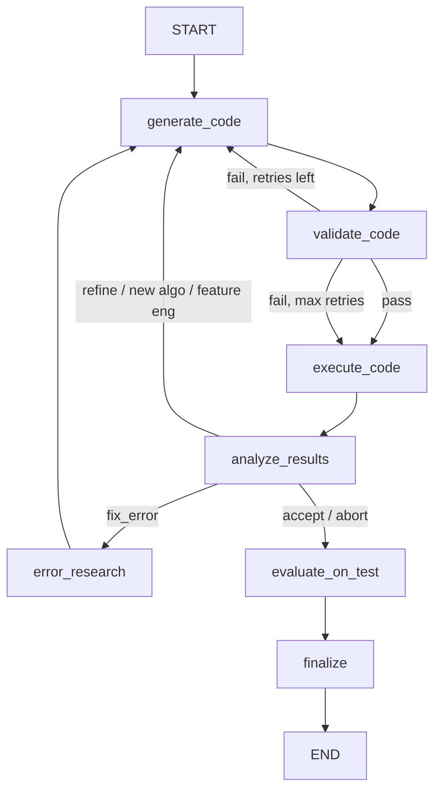

# Sklearn Subagent

Scikit-learn framework subagent that iteratively generates training code, executes it in a sandbox, analyzes results, and refines the approach.

Lives under `agents/frameworks/sklearn/` and extends `BaseFrameworkAgent` from `agents/base/`.

## Flow



The sklearn agent receives pre-built execution plans and split data from the upstream plan and analyst agents. It focuses purely on the generate-validate-execute-analyze iteration loop.

### Iteration Loop

After `analyze_results`, the agent decides:
- **accept** / **abort** -- evaluate on held-out test set, then finalize and produce report
- **fix_error** -- web search for error resolution, then regenerate code
- **refine_params** -- adjust hyperparameters (one at a time, IMPROVE pattern)
- **try_new_algo** -- switch algorithm family
- **feature_engineer** -- add feature transformations

Max 5 iterations by default. Deterministic budget limits (wall time, iteration count) stop runaway loops without LLM calls.

### Pre-execution Validation

Generated code passes through `validate_code` (base node, zero LLM tokens) before execution. Checks: syntax, import availability, `===RESULTS===` marker, `report_metric()` call. Max 2 validation retries before proceeding to execution anyway.

### Test Evaluation

After accepting a model, `evaluate_on_test` (base node) evaluates the best model on the held-out test set. This produces `test_metrics` passed to the summary agent.

## Nodes

| Node | LLM Calls | Source | Description |
|------|-----------|--------|-------------|
| `generate_code` | 1 | `frameworks/sklearn/nodes/` | Generates complete sklearn code using execution plan, split data paths, analysis report, and experiment history |
| `validate_code` | 0 | `base/nodes/` | Static analysis: syntax check, import check, results marker, report_metric |
| `execute_code` | 0 | `base/nodes/` | Sandboxed subprocess execution with timeout enforcement |
| `analyze_results` | 0-1 | `base/nodes/` | Parses metrics, decides next action, writes to experiment journal |
| `error_research` | 1 (search) | `frameworks/sklearn/nodes/` | Uses Google Search grounding to find solutions for execution errors |
| `evaluate_on_test` | 1 | `base/nodes/` | Evaluates best model on held-out test set |
| `finalize` | 1 | `base/nodes/` | Generates final report |

## Input (from Plan + Analyst)

- `execution_plan` -- structured plan with algorithms, preprocessing, metrics, success criteria
- `split_data_paths` -- `{"train": path, "val": path, "test": path}`
- `analysis_report` -- markdown report from the analyst agent
- `data_profile` -- structured data profile (shape, columns, dtypes, etc.)
- `problem_type` -- classification, regression, clustering, etc.

## Skills

SKILL.md files in `skills/` follow the [Anthropic Agent Skills specification](https://agentskills.io/specification). Each skill defines capabilities, algorithms, metrics, and a recommended approach for a specific problem type.

```
skills/
├── classification/SKILL.md   — Binary/multi-class classification
├── regression/SKILL.md       — Continuous numeric prediction
└── clustering/SKILL.md       — Unsupervised grouping
```

## Examples

`agent.py` includes `EXAMPLES` and a `_run_examples()` entrypoint to validate the agent in isolation:

```bash
uv run python -m scientist_bin_backend.agents.frameworks.sklearn.agent
```

## Key Files

| File | Purpose |
|------|---------|
| `agent.py` | `SklearnAgent(BaseFrameworkAgent)` with `EXAMPLES` + `_run_examples()` |
| `states.py` | `SklearnState(BaseMLState)` — thin extension, add sklearn-specific fields here |
| `schemas.py` | `SklearnStrategyPlan` extending base `StrategyPlan` |
| `nodes/code_generator.py` | Code generation with retry context, validation errors, and experiment history |
| `nodes/error_researcher.py` | Web search for sklearn error resolution |
| `prompts.py` | `CODE_GENERATOR_PROMPT` — sklearn-specific code generation prompt |

## Model

Uses `gemini-3.1-pro-preview` via `get_agent_model("sklearn")` for code generation. Error research uses Google Search grounding via `search_with_gemini()`.
