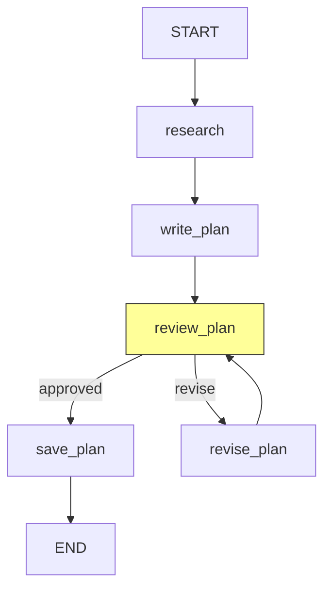

# Plan Agent

Generates and reviews an ML execution plan with human-in-the-loop approval.

Receives upstream context from the **central orchestrator** (`task_analysis`) and the **analyst agent** (`data_profile`, `analysis_report`, `problem_type`). Produces a structured `ExecutionPlan` consumed by the downstream **sklearn agent**.

## Flow



The `review_plan` node (highlighted) uses LangGraph `interrupt()` to pause the graph and present the plan to a human reviewer. The reviewer can approve or provide feedback for revision. When `auto_approve=True`, the interrupt is skipped.

## Nodes

| Node | LLM Calls | Description |
|------|-----------|-------------|
| `research` | 1 (search) | Uses Google Search grounding to find best practices, algorithm guidance, and common pitfalls |
| `write_plan` | 1 (structured) | Generates a structured `ExecutionPlan` and human-readable markdown from research + upstream context |
| `review_plan` | 0 | Pauses for human review via `interrupt()`, or auto-approves |
| `revise_plan` | 1 (structured) | Rewrites the plan based on human feedback, preserving approved parts |
| `save_plan` | 0 | Saves `execution_plan.json` to `outputs/runs/{id}/plan/` |

**LLM calls (happy path): 2** — 1 search-grounded + 1 structured output.

## Schemas

| Schema | Purpose |
|--------|---------|
| `ExecutionPlan` | Structured output: approach summary, problem type, algorithms, pipeline preprocessing, feature engineering, metrics, CV strategy, success criteria, hyperparameter tuning approach |

## Problem-Type-Specific Plans

Execution plans differ by problem type in several key ways:

| Aspect | Classification | Regression | Clustering |
|---|---|---|---|
| `target_column` | Required (categorical) | Required (continuous) | **None** (unsupervised) |
| Algorithms | LogisticRegression, RF, GBM, SVM | Ridge, Lasso, RF, GBR, SVR | KMeans, DBSCAN, Agglomerative |
| Metrics | accuracy, F1, ROC-AUC, precision, recall | MAE, RMSE, R2, explained variance | silhouette, Calinski-Harabasz, Davies-Bouldin |
| CV strategy | StratifiedKFold | KFold | KFold (on internal metrics) |
| Success criteria | Metric thresholds (e.g., F1 > 0.85) | Error thresholds (e.g., RMSE < X) | Internal quality thresholds |

The plan agent receives `problem_type` from the analyst and uses it to guide algorithm selection, metric definition, and success criteria in the generated `ExecutionPlan`.

## HITL Approval Flow

The plan review uses LangGraph's `interrupt()` mechanism:

1. `review_plan` emits a `plan_review_pending` event with the plan markdown
2. The graph pauses and waits for the caller to resume with feedback
3. Approval tokens (`approve`, `yes`, `lgtm`, etc.) approve the plan
4. Any other text is treated as revision feedback, triggering `revise_plan`
5. After `max_revisions` (default 3), the plan is auto-approved

When `auto_approve=True` (set via CLI `--auto-approve` or API `auto_approve_plan`), the interrupt is skipped entirely and the plan proceeds directly to `save_plan`.

## Upstream Context

The plan agent receives rich context from upstream agents via `build_upstream_context()` in `nodes/_context.py`:

- **Central orchestrator:** `task_analysis` (task type, complexity, considerations, data characteristics estimates)
- **Analyst agent:** `data_profile` (actual shape, columns, types, target, missing values, class distribution), `analysis_report` (markdown), `problem_type` (validated)

Data cleaning and train/val/test splitting are handled by the analyst — the plan focuses on sklearn-pipeline-level preprocessing, algorithm selection, evaluation, and tuning.

## Examples

```bash
uv run python -m scientist_bin_backend.agents.plan.agent
```

## Key Files

| File | Purpose |
|------|---------|
| `agent.py` | `PlanAgent` class wrapping the graph, `EXAMPLES` + `_run_examples()` |
| `graph.py` | StateGraph: `research -> write_plan -> review_plan` with revision loop + `save_plan` |
| `states.py` | `PlanState` TypedDict with research, plan, and HITL fields |
| `schemas.py` | `ExecutionPlan` Pydantic model |
| `nodes/_context.py` | Shared `build_upstream_context()` helper |
| `nodes/researcher.py` | Web research node (Google Search grounding) |
| `nodes/plan_writer.py` | Plan generation node + `_plan_to_markdown()` |
| `nodes/plan_reviewer.py` | HITL review node, revision node, `check_approval()` router |
| `nodes/plan_saver.py` | Saves execution plan JSON to disk |
| `prompts.py` | Plan writer and plan reviser prompts |

## Model

Uses `gemini-3.1-pro-preview` via `get_agent_model("plan")` for all LLM calls. The pro model is chosen for its strength in research synthesis and detailed structured plan generation.
