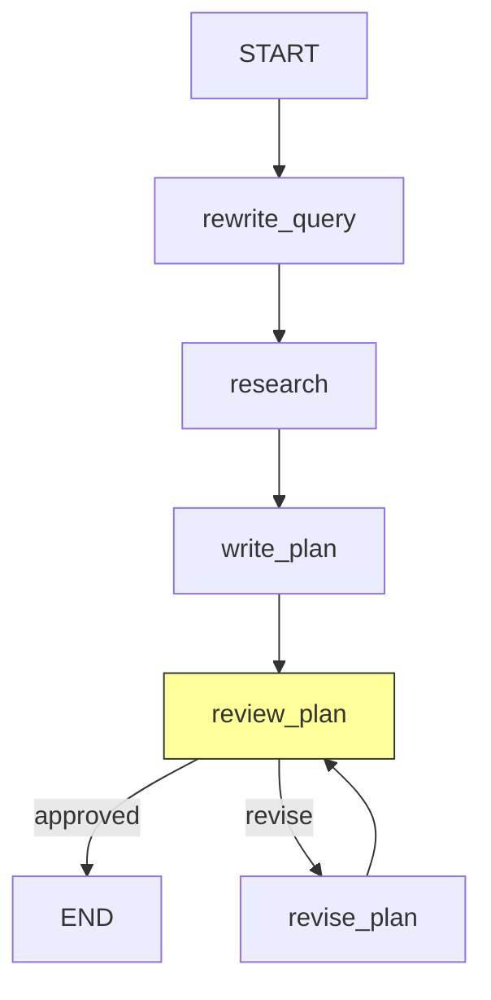

# Plan Agent

Generates and reviews an ML execution plan with human-in-the-loop approval.

## Flow



The `review_plan` node (highlighted) uses LangGraph `interrupt()` to pause the graph and present the plan to a human reviewer. The reviewer can approve or provide feedback for revision. When `auto_approve=True`, the interrupt is skipped.

## Nodes

| Node | LLM Calls | Description |
|------|-----------|-------------|
| `rewrite_query` | 1 (structured) | Enriches the user's raw objective into a precise ML problem statement with requirements and constraints |
| `research` | 1 (search) | Uses Google Search grounding to find best practices, algorithm guidance, and common pitfalls |
| `write_plan` | 1 (structured) | Generates a structured `ExecutionPlan` and human-readable markdown from research + context |
| `review_plan` | 0 | Pauses for human review via `interrupt()`, or auto-approves |
| `revise_plan` | 1 (structured) | Rewrites the plan based on human feedback, preserving approved parts |

## HITL Pattern

The plan review uses LangGraph's `interrupt()` mechanism:

1. `review_plan` emits a `plan_review_pending` event with the plan markdown.
2. The graph pauses and waits for the caller to resume with feedback.
3. Approval tokens (`approve`, `yes`, `lgtm`, etc.) approve the plan.
4. Any other text is treated as revision feedback.
5. After `max_revisions` (default 3), the plan is auto-approved.

## Schemas

| Schema | Purpose |
|--------|---------|
| `RewrittenQuery` | Structured output: enhanced objective, key requirements, constraints |
| `ExecutionPlan` | Structured output: approach summary, problem type, algorithms, preprocessing, metrics, success criteria, split strategy |

## Examples

`agent.py` should include `EXAMPLES` and a `_run_examples()` entrypoint to validate the agent in isolation:

```bash
uv run python -m scientist_bin_backend.agents.plan.agent
```

## Key Files

| File | Purpose |
|------|---------|
| `agent.py` | `PlanAgent` class wrapping the graph (add `EXAMPLES` + `_run_examples()`) |
| `graph.py` | StateGraph: `rewrite_query -> research -> write_plan -> review_plan` with revision loop |
| `states.py` | `PlanState` TypedDict with query rewriting, research, plan, and HITL fields |
| `schemas.py` | `RewrittenQuery`, `ExecutionPlan` Pydantic models |
| `nodes/query_rewriter.py` | Objective enrichment node |
| `nodes/researcher.py` | Web research node (Google Search grounding) |
| `nodes/plan_writer.py` | Plan generation node + `_plan_to_markdown()` |
| `nodes/plan_reviewer.py` | HITL review node, revision node, `check_approval()` router |
| `prompts.py` | Query rewriter, plan writer, and plan reviser prompts |

## Model

Uses `gemini-3.1-pro-preview` via `get_agent_model("plan")` for all LLM calls. The pro model is chosen for its strength in research synthesis and detailed structured plan generation.
