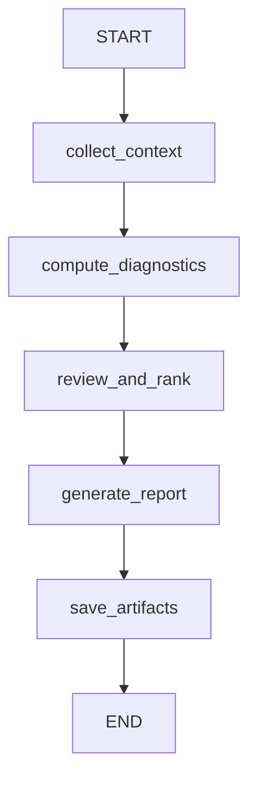

# Summary Agent

Reviews all experiment runs, selects the best model, and generates a comprehensive data-science report enriched with pre-computed diagnostics (CV stability, overfitting analysis, feature importances, confusion matrices, hyperparameter sensitivity).

## Flow



A 5-node pipeline (2 LLM calls) that normalizes upstream data, computes diagnostics, ranks models, and produces an enriched report with structured chart data for frontend visualization.

## Nodes

| Node | LLM Calls | Description |
|------|-----------|-------------|
| `collect_context` | 0 | Normalizes upstream data — extracts enriched diagnostic fields (CV fold scores, feature importances, confusion matrices, etc.) from experiment records into organized collections keyed by algorithm. Framework-agnostic adapter layer. |
| `compute_diagnostics` | 0 | Pure computation: CV stability analysis, overfitting detection (train-val gap), hyperparameter sensitivity ranking, Pareto frontier (performance vs time), and chart-ready data structures for the frontend. |
| `review_and_rank` | 1 (structured) | Single LLM call that ranks all models and selects the best with reasoning. Uses pre-computed diagnostics for informed judgment. Produces `ReviewAndRankResult`. |
| `generate_report` | 1 (structured) | Generates comprehensive markdown report with enriched sections (executive summary, CV stability, feature importance, error analysis). Uses diagnostics for narrative grounding. Produces `SummaryReport`. |
| `save_artifacts` | 0 | Saves `report.md` and `chart_data.json` to disk under `outputs/runs/{id}/summary/`. Emits `summary_completed` event. |

## Input (from upstream agents)

- `objective` -- the original ML task description
- `problem_type` -- classification, regression, clustering, etc.
- `execution_plan` -- the strategy plan from the plan agent
- `analysis_report` -- markdown report from the analyst agent
- `data_profile` -- structured data profile from the analyst agent
- `plan_markdown` -- human-readable execution plan
- `split_data_paths` -- `{"train": path, "val": path, "test": path}` for reproducibility
- `framework_results` -- full results dict from the framework agent
- `experiment_history` -- list of per-iteration experiment records (with enriched diagnostic fields)
- `test_metrics` -- metrics from held-out test set evaluation
- `test_diagnostics` -- enriched test results (confusion matrix, residual stats)
- `generated_code` -- final training code for reproducibility
- `test_evaluation_code` -- test evaluation code for reproducibility

### Enriched Experiment Record Fields

Each record in `experiment_history` may include these optional diagnostic fields (populated when the generated training code extracts them):

| Field | Type | Description |
|-------|------|-------------|
| `cv_fold_scores` | `dict[str, list[float]]` | Per-fold CV scores for each metric |
| `cv_results_top_n` | `list[dict]` | Top-10 hyperparameter combinations from search |
| `feature_importances` | `list[dict]` | `[{feature, importance}, ...]` sorted by importance |
| `confusion_matrix` | `dict` | `{labels: [...], matrix: [[...]]}` (classification) |
| `residual_stats` | `dict` | `{mean, std, max_abs, percentiles}` (regression) |

## Output

- `summary_report` -- full markdown report document
- `best_model` -- name of the best algorithm
- `best_hyperparameters` -- hyperparameters of the best model
- `best_metrics` -- combined validation and test metrics
- `model_rankings` -- ranked list of all models tried
- `selection_reasoning` -- detailed reasoning for best model selection
- `report_sections` -- structured sections dict (includes `chart_data` for frontend)

## Report Sections

| Section | Content |
|---------|---------|
| Executive Summary | 3-5 sentence TL;DR |
| Dataset Overview | Shape, features, target, class distribution, quality |
| Methodology | Preprocessing, algorithms, CV strategy, tuning |
| Model Comparison | Markdown table with val metric, CV std, training time |
| CV Stability Analysis | Per-algorithm fold-score variance and consistency |
| Best Model Analysis | Deep-dive with overfitting analysis |
| Feature Importance | Top features and their impact |
| Hyperparameter Analysis | Sensitivity ranking and optimal ranges |
| Error Analysis | Confusion matrix (classification) or residuals (regression) |
| Conclusions | Key findings |
| Recommendations | 3-6 actionable next steps |
| Reproducibility Notes | Packages, data paths, code, seeds |

## Schemas

| Schema | Purpose |
|--------|---------|
| `ModelRanking` | Single model assessment: rank, algorithm, metrics, strengths, weaknesses |
| `ReviewAndRankResult` | Combined ranking + selection with reasoning (single LLM call output) |
| `SummaryReport` | Full enriched report with 12 sections |
| `ChartData` | Structured chart data for frontend visualization (model comparison, CV, features, confusion) |
| `FeatureImportanceItem` | Single feature importance entry (feature name + importance value) |
| `CVFoldScores` | Fold-level scores for a single metric (scores list + mean) |
| `CVStabilityEntry` | CV stability metrics for diagnostics computation |
| `OverfitEntry` | Train-val gap analysis for diagnostics computation |
| `HyperparamSensitivityEntry` | Hyperparameter impact for diagnostics computation |

## Examples

```bash
uv run python -m scientist_bin_backend.agents.summary.agent
```

## Key Files

| File | Purpose |
|------|---------|
| `agent.py` | `SummaryAgent` class wrapping the graph + `EXAMPLES` + `_run_examples()` |
| `graph.py` | StateGraph: 5-node pipeline |
| `states.py` | `SummaryState` TypedDict with input, intermediate, and output fields |
| `schemas.py` | `ModelRanking`, `ReviewAndRankResult`, `SummaryReport`, diagnostics models |
| `prompts.py` | `REVIEW_AND_RANK_PROMPT` and `REPORT_GENERATION_PROMPT` |
| `nodes/context_collector.py` | Normalize upstream data (0 LLM) |
| `nodes/diagnostics_computer.py` | Pure computation of analytics (0 LLM) |
| `nodes/reviewer.py` | Combined ranking + selection (1 LLM) |
| `nodes/report_generator.py` | Enriched markdown report generation (1 LLM) |
| `nodes/artifact_saver.py` | Save report + chart data to disk (0 LLM) |

## Problem-Type-Specific Diagnostics

The `collect_context` node (`nodes/context_collector.py`) extracts different diagnostic fields depending on the problem type. All fields are keyed by algorithm name.

| Problem Type | Extracted Fields | Description |
|---|---|---|
| Classification | `confusion_matrices` | `{labels, matrix}` per algorithm + `__test__` key for test-set |
| Regression | `residual_stats` | `{mean, std, max_abs, percentiles}` per algorithm + `__test__` |
| Clustering | `cluster_scatter`, `elbow_data`, `cluster_sizes`, `cluster_profiles`, `silhouette_per_sample` | Visualization and profiling data per algorithm |

### Clustering-Specific Context

For clustering experiments, `context_collector.py` extracts five additional fields from each experiment record:

- **`cluster_scatter`** -- 2D projection coordinates (PCA/t-SNE) with cluster labels for scatter-plot visualization
- **`elbow_data`** -- Inertia values across different k values for elbow-method charts
- **`cluster_sizes`** -- Number of samples per cluster
- **`cluster_profiles`** -- Mean feature values per cluster for profiling
- **`silhouette_per_sample`** -- Per-sample silhouette coefficients for detailed cluster quality analysis

Test-set diagnostics from `test_diagnostics` are also mapped under a special `__test__` key for `cluster_scatter` and `cluster_profiles`.

### Shared Fields (All Problem Types)

All problem types share: `cv_fold_scores`, `cv_results` (top-N hyperparam combos), `feature_importances`. These are extracted regardless of problem type when present in experiment records.

## Model

Uses `gemini-3-flash-preview` via `get_agent_model("summary")` for the 2 LLM calls. The flash model is sufficient for summarization and report generation tasks.
