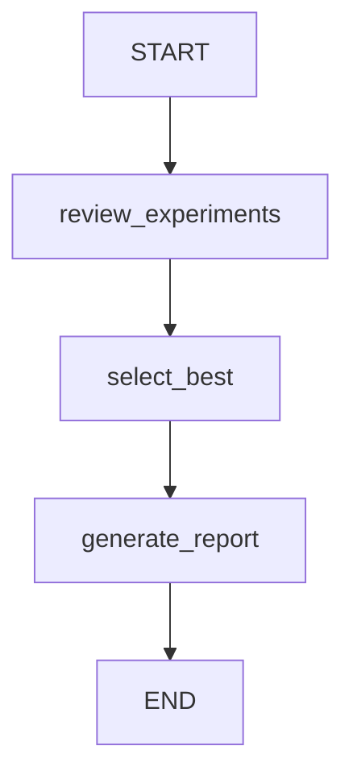

# Summary Agent

Reviews all experiment runs, selects the best model, and generates a comprehensive data-science report.

## Flow

A linear 3-node pipeline that synthesizes all upstream results into a final report with model rankings and recommendations.

## Nodes

| Node | LLM Calls | Description |
|------|-----------|-------------|
| `review_experiments` | 1 (structured) | Analyzes all experiment runs and produces a ranked `ModelRankingList`. Formats experiment history and run details into a comparison prompt. |
| `select_best` | 1 (structured) | Selects the best model with a structured `BestModelSelection` including reasoning, primary metric, and hyperparameters. |
| `generate_report` | 1 (structured) | Produces a comprehensive `SummaryReport` covering dataset overview, methodology, model comparison table, best model analysis, hyperparameter insights, conclusions, and recommendations. Saves to disk as markdown. |

## Input (from upstream agents)

- `objective` -- the original ML task description
- `problem_type` -- classification, regression, clustering, etc.
- `execution_plan` -- the strategy plan from the plan agent
- `analysis_report` -- markdown report from the analyst agent
- `sklearn_results` -- full results dict from the sklearn agent
- `experiment_history` -- list of per-iteration experiment records

## Output

- `summary_report` -- full markdown report document
- `best_model` -- name of the best algorithm
- `best_hyperparameters` -- hyperparameters of the best model
- `best_metrics` -- combined validation and test metrics
- `model_comparison` -- ranked list of all models tried

## Schemas

| Schema | Purpose |
|--------|---------|
| `ModelRanking` | Single model assessment: rank, algorithm, metrics, strengths, weaknesses |
| `ModelRankingList` | Wrapper for structured output of ranked models |
| `BestModelSelection` | Best model pick with reasoning and primary metric |
| `SummaryReport` | Full report: title, dataset overview, methodology, comparison table, analysis, conclusions, recommendations, reproducibility notes |

## Key Files

| File | Purpose |
|------|---------|
| `agent.py` | `SummaryAgent` class wrapping the graph |
| `graph.py` | StateGraph: `review_experiments -> select_best -> generate_report` |
| `states.py` | `SummaryState` TypedDict with input context, analysis, and output fields |
| `schemas.py` | `ModelRanking`, `ModelRankingList`, `BestModelSelection`, `SummaryReport` |
| `nodes/experiment_reviewer.py` | Experiment history analysis and model ranking |
| `nodes/model_selector.py` | Best model selection with reasoning |
| `nodes/report_generator.py` | Comprehensive markdown report generation, saved to `outputs/runs/{id}/summary/report.md` |
| `prompts.py` | Experiment review, model selection, and report generation prompts |

## Model

Uses `gemini-3-flash-preview` via `get_agent_model("summary")` for all LLM calls. The flash model is sufficient for summarization and report generation tasks.
